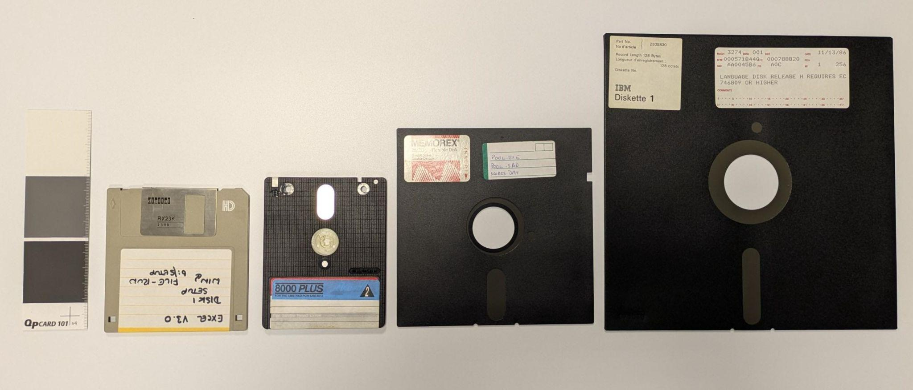
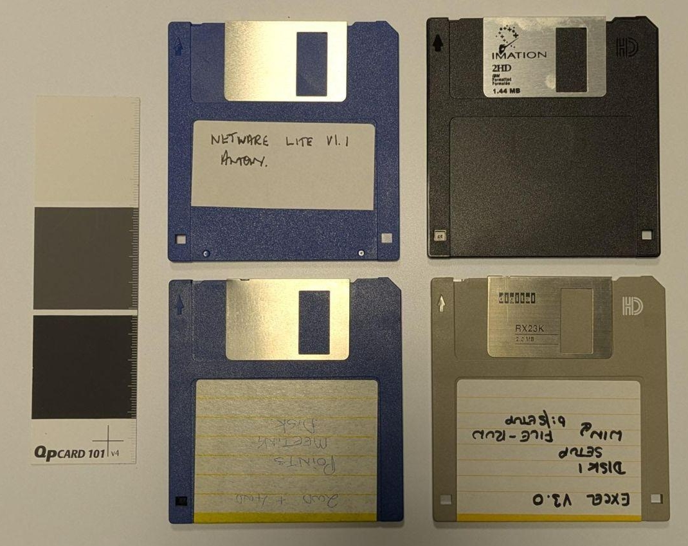
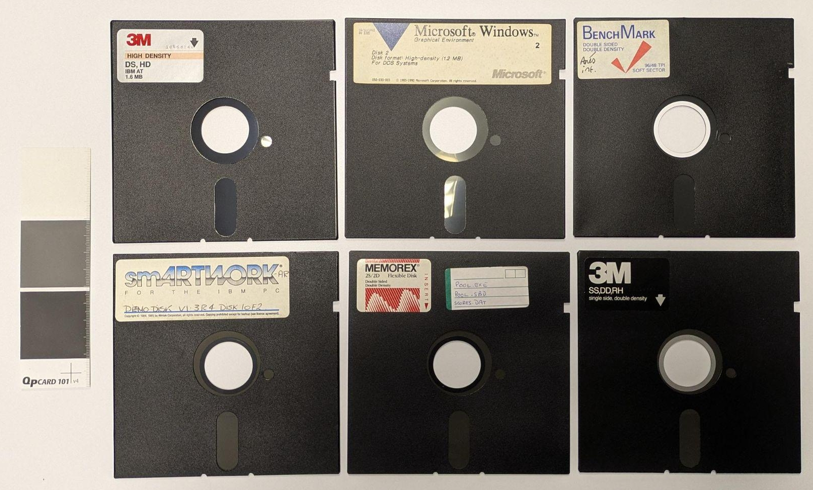
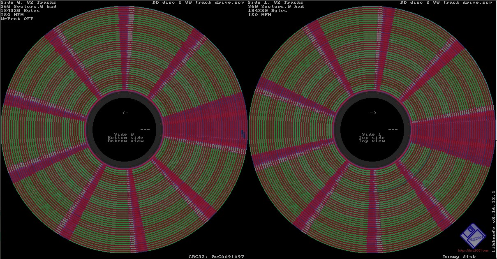
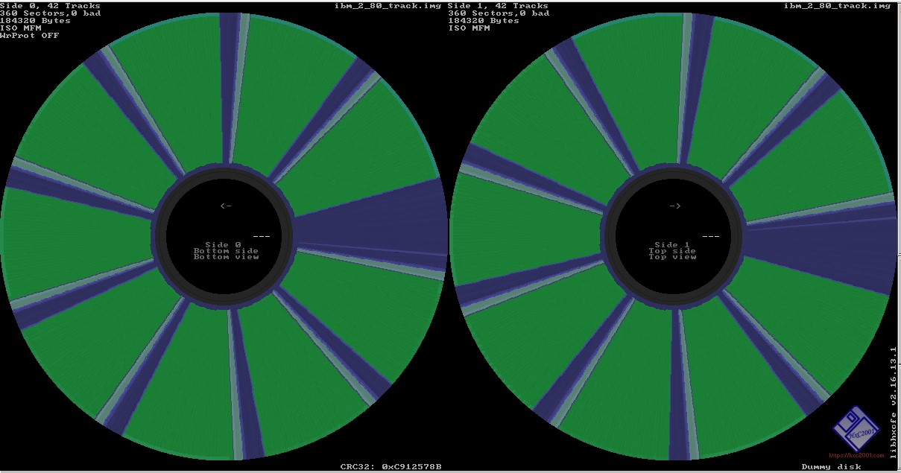

:::{note} Status: Open For Updates
This guide to imaging floppy disks is being developed as part of the [Future Nostalgia project](https://www.lib.cam.ac.uk/future-nostalgia), led by [Cambridge University Library](https://www.lib.cam.ac.uk/) and supported by the [Digital Preservation Coalition](https://dpconline.org).

You can add feedback, comments or updates via [GitHub issues](https://github.com/digipres/the-floppy-guide/issues) if you prefer.
:::

:::{aside}

:::

This guide is written for practitioners wanting to create disk images of floppy disks with the intention of preserving them for the long-term. This guide will focus on 8-inch, 5.25-inch, 3.5-inch and 3-inch [<u>floppy disks</u>](https://en.wikipedia.org/wiki/Floppy_disk) and will only focus on getting material from these disks and will not cover writing disks. Other resources are available for further information on floppy disks, as outlined in Section 5.

The guide will assume some basic knowledge on some terms, which include digital preservation and assume that you are familiar with tools such as write blockers and feel confident configuring different pieces of software, using different operating systems and the command line. Further resources on digital preservation and other basics can be found in Section 5. This guide will not be a step-by-step demonstration of all the different tools and floppy controllers; this decision was made as the hardware and software around floppy controllers can change quite quickly, but will serve as a basis on how to get started with floppy disks. The focus will be on imaging and preserving the disks, not on extracting files. However, there will be links to further resources on next steps.

The first iteration of this guide was created as part of the [<u>Future Nostalgia</u>](https://www.lib.cam.ac.uk/future-nostalgia) project and has multiple sources that feed into it:

- [<u>Interviews with experts within the retro computing field</u>](https://www.repository.cam.ac.uk/items/154ad280-7c47-49eb-9cbf-24b6762f6c1c).

- [<u>Floppy disks workshops</u>](https://medium.com/digital-preservation-at-cambridge-university/diskettes-and-discussions-what-we-learned-from-the-future-nostalgia-workshops-021d51e4344e) with experts in the digital preservation community.

- A number of workshops and other events over the year (including the [<u>Copy that Floppy Cafe</u>](https://www.lib.cam.ac.uk/research-institute/events/floppy-disks-workshop))

- A round of editing and checking by the community.

This work is a continuation of other guides and resources on floppy disks, in particular [<u>the Archivist’s Guide to Kryoflux</u>](https://github.com/archivistsguidetokryoflux/archivists-guide-to-kryoflux) and [<u>a workshop at iPRES 2024 which focused on imaging obscure floppy disks</u>](https://zenodo.org/records/13828372).

A list of all contributors can be found at the end of this guide.

The sections of the guide that will be covered are as follows:

- **Identifying your carrier -** This is the first step and will help you understand what type of carrier you have and how to find out more information on it.

- **Acquiring hardware -** Acquiring hardware compatible with your carrier will depend on the type of carrier that you have, but this will cover the basics that you need to image a floppy disk and also point out some things to keep in mind when acquiring hardware.

- **Cleaning and maintaining carriers and hardware -** This will cover the basics to keep in mind when using floppy disks drives and will also cover options for damaged, dirty or mouldy floppy disks.

- **Imaging floppy disks -** This will cover the basic steps of imaging a floppy disk and will explain the difference in creating a flux stream and other steps to consider.

- **Further steps and where to get help -** This will cover further steps to consider when preserving floppy disks and will also point to other resources for further information.

As a side note, floppies, floppy disk, carriers and disks will be used interchangeably throughout this guide.

# Identifying your carrier

The first step in setting up your workflow is to identify your floppy disk. There are a number of resources out there to identify the carriers in your collection, including [<u>Know Your Digital Storage Media</u>](https://lib.utsa.edu/knowyourmedia/index.html) by UTSA Libraries Special Collections and [<u>The Museum of Obsolete Media</u>](https://obsoletemedia.org/). As a reminder, this guide will only be covering 8-inch, 5.25-inch, 3.5-inch and 3-inch floppy disks. There are more types of floppy disks out there, as helpfully highlighted by [<u>the Obsolete Media museum</u>](https://obsoletemedia.org/data/floppy/), but these are not covered in this guide.

*All floppy disks covered in this guide from left to right: 3.5-inch floppy disk, 3-inch (Amstrad) floppy disk, 5.25-inch floppy disk and 8-inch floppy disk.*

If you are certain you have one of these types of disks in your collection, the next step would be to find out as much as possible about the floppy disk. This is important, as it can help determine the type of hardware that is needed to ensure the best image is made of the disk. The label on the floppy disk can be very helpful in determining its type. Also, if possible, try to see if there is more information to gather from the depositor or any other source of where this material has come from. It is also worthwhile to consider photographing the carrier at this point, preserving a photograph of the physical floppy disk alongside the disk image can be very helpful at later stages to provide context and a better idea of where the disk image came from.

There are a number of features that can give an indication of what type of floppy disk they might be. In most cases, for the 3.5-inch floppy disks, two holes on the bottom of the disk indicate a high density (HD) disk and one hole a double density (DD) disk. Diagrams of these holes and the layout of 3.5-inch disks can be found [<u>here</u>](https://www.brutman.com/Diskettes/Diskette_handling.html), images of these examples can be found further down in this section. Most HD 3.5-inch disks will also include the letters ‘HD’ in the top right corner. For 5.25-inch floppies it can be harder to distinguish, sometimes there is a white/black/gold hub ring around the centre hole of the floppy disks that are DD, but this is not always the case. There is also the possibility of a hard sectored floppy disk; these will have [<u>multiple index holes</u>](https://retrocmp.de/fdd/diskette/diskette.htm). There is a single notch on 5.25-inch floppy disks, but sometimes you will find a second notch; this is a ‘flippy’ disk and will be discussed further below. Hard sectored floppy disks can only be 8-inch or 5.25-inch in size.

It’s also important to recognise that the types of floppy disks encountered can vary significantly depending on geography and market conditions of the time. There was a wide variety of systems, and therefore, floppy disk formats in use during the 1970/1980s. Before the dominance of IBM, which was first accomplished by the company in North America [<u>in the mid-1980s</u>](https://www.atarimagazines.com/compute/issue79/The_MS-DOS_Invasion.php), many different standards and systems could be found on the market. Systems such as Kaypro, Osborn, Commodore and Apple were popular in the US, whilst systems such as the Amstrad CPC and PCW, Atari and Amiga were popular [<u>in the UK</u>](https://www.computerweekly.com/feature/CW50-How-UK-home-brew-gave-computing-to-the-masses). Similarly, in France, machines like the Thomson MO series and Minitel terminals contributed to a diversity of disk types. In Australia systems such as the local MicroBee and Exidy Sorcerer were popular for 5.25-inch disks.

In Japan and parts of Asia, [<u>an adaptation of</u> <u>IBM’s disk format</u> <u>emerged</u>](https://www.theregister.com/2013/06/27/feature_30_years_of_msx/) due to the need for encoding character sets beyond the Latin alphabet. Japanese PCs such as NEC’s PC-98 line required disk formats that could handle Kanji and Katakana characters, leading to region-specific variations. Do keep this in mind when analysing your collection. Regional differences will be present and will affect the hardware and possible software needed to image and analyse disks.

The labels of floppy disks are able to highlight a number of things:

- **How many sides the disk was certified to use.** Early disks are often labeled as SS (single-sided) or DS (double-sided). While the physical media on most disks is capable of holding data on both sides, a single-sided designation indicates that only one side has been tested and certified by the manufacturer. DS disks effectively doubled the capacity and could be used in drives that supported flipping (as can be seen with 3-inch Amstrad disks) or writing on both surfaces.

- **The method of encoding data on (‘density’ of) the disk.** Floppy disks evolved through different data encoding methods, and improvements in drive technology, each increasing the amount of data that could be stored. SD (Single Density) disks used [<u>FM (Frequency Modulation)</u>](https://en.wikipedia.org/wiki/Frequency_modulation_encoding) encoding and were among the earliest formats. This was followed by DD (double density), which employed [<u>MFM (Modified Frequency Modulation)</u>](https://en.wikipedia.org/wiki/Modified_frequency_modulation) encoding and roughly doubled the capacity. At the same time some systems used [<u>Group Coded Recording (GCR)</u>](https://en.wikipedia.org/wiki/Group_coded_recording), derived from a system first used on magnetic tapes. Later, as drive technology improved, MFM encoded HD (high density) disks featuring improved magnetic coatings that could store 1.2MB (5.25-inch) or 1.44MB (3.5-inch). Very rarely, ED (extra high density) disks appeared, capable of 2.88MB on 3.5-inch floppies. These labels not only showcase the expected capacity on the disks, but also serve as guidance for drive compatibility. This will be discussed in more detail in the next section.

- **Operating system or formatting type.** For instance, a disk might be labeled ‘DOS’ to indicate it had been formatted for IBM PC-compatible systems running MS-DOS. Others might carry labels for [<u>Macintosh (HFS)</u>](https://en.wikipedia.org/wiki/Hierarchical_File_System_(Apple)), [<u>CP/M</u>](https://en.wikipedia.org/wiki/CP/M), or other environments.

*Different types of floppy disks. On the left is a group of 3.5-inch floppies. The two on the left are examples of DD disks (having one notch and no ‘HD’ logo on the top right), and the two on the right are of HD disks (with two notches at the bottom and the ‘HD’ logo). The notch on the left hand-side of the HD 3.5-inch disks is sometimes covered up because of the write tab being engaged, more on this in Section 4. The picture on the right highlights a wide range of 5.25-inch floppy disks. Including DD and HD disks, all DS. Where manufacturer labelling is present, the information it provides about the disk’s density, format, etc., is accurate in these examples.*

It should be noted that labels can be misleading. Floppy disks were expensive at the time and therefore disks were re-used. This means that it is possible to find unexpected material on disks and sometimes they are even in other formats or densities than the label would suggest. Keep this in mind when imaging. The label is a great starting point, but can be incorrect. It is also worth checking any disks that appear to have been commercially produced, like software or operating system installation disks, that may be present in your collection, as these could also be re-used for personal data.

If you have floppy disks that look slightly different than described or have contradicting features, you may have a repurposed or modified disk in your collection. The most common ones are the DD 3.5-inch floppy disk with a [<u>second hole</u>](https://retrocomputing.stackexchange.com/questions/9559/was-drilling-35-720-kib-floppies-to-upgrade-them-to-1440-kib-at-all-reliable). Or the 5.25-inch SS disks with an [<u>extra notch</u>](https://archive.org/details/1981-03-compute-magazine/page/70/mode/2up?view=theater) to write on both sides, also known as a [<u>Flippy Disk</u>](https://github.com/keirf/greaseweazle/wiki/Flippy-Disks). As mentioned before, floppy disks were expensive and people found creative ways to expand the storage on their disks. Sometimes the notch on the right-hand side of the 5.25-inch floppy disk is covered up, this has to do with [<u>write protection</u>](https://forum.vcfed.org/index.php?threads/floppy-write-protect-question.71111/).

Another floppy disk variant to watch out for in old collections are the [<u>‘Floptical’</u>](https://en.wikipedia.org/wiki/Floptical) types and LS-120/240 ([<u>SuperDisk</u>](https://goughlui.com/2013/05/02/tech-flashback-iomega-zip-100-vs-3mimation-superdisk-ls-120-showdown/)). [<u>Mechanically</u>](https://www.vogons.org/viewtopic.php?t=49893) they can fit into 3.5-inch drives since the SuperDisk and Floptical drives are backward compatible and could read ‘standard’ floppies. These disks cannot be imaged without the proper Superdisk or Floptical drive. They will also need a different imaging workflow, as the methods in this guide are not compatible with these drives.

Once you have a better idea of what you have in the collection, the hardware can be sourced for the imaging.

# Acquiring Hardware

As you now have a better understanding of what floppy disks you have in your collection, it is time to acquire hardware to read the content on the disks. This is done in a number of steps. The most important thing is to first acquire a floppy disk drive, secondly a floppy controller, and thirdly you will have to ensure you have the right cables and power connections to use the floppy disk drive and floppy controller.

## 2.1 What floppy disk drive do I need?

The type of floppy disk drive is determined by the type of floppy disk that you have. This section is organised by size of the floppy disk, but there is also a specific section on Apple formatted disks (that is organised by size), as these are slightly different and, for some, specific hardware is needed. If you think you have Apple formatted disks in your collection, please consult this section before looking at the wider overview of the floppy disk drives.

### **8‑inch floppy disks** 

8-inch floppy disks were the earliest and widely adopted removable magnetic storage medium and were particularly common in minicomputers and mainframes from the 1970s and early 1980s. These disks typically store between 80 KB and 1.2 MB, depending on the density and encoding. Drives from [<u>Shugart</u> <u>Associates</u>](https://forum.vcfed.org/index.php?threads/selecting-an-8-floppy-drive.56007/), especially the SA800/801 series (which are single sided) or the SA850/851 (which are double sided), remain highly regarded due to their robust construction. The drives are also full height, making them easier to clean than the half height drives that were also produced during this time. [<u>OEM manuals</u>](https://retrocmp.de/fdd/shugart/801/SA800-801_Diskette_Drive_OEM_Manual_1977_OCR.pdf) for these drives are also easy to find online. Texas Peripherals, part of Tandy Corporation, made a licensed clone of the SA800. Many were used in Radio Shack business computers, their external drive bays are also considered a reliable option when sourcing these drives.

When sourcing 8‑inch drives today, it’s advisable to select units that avoid exposing internal mains voltages (some earlier models used line power internally for spindle motors and logic boards). Drives with external, low-voltage power supplies are not only safer to work on but also far easier to adapt to floppy controllers, this is normally 24V. A good overview of 8-inch drives and disks can be found in [<u>this video</u>](https://www.youtube.com/watch?v=oL0LXSE1jeM). Work on how to set up and run an 8-inch drive in an archival setting was done by Denise de Vries, which includes [<u>a conference paper</u>](https://phaidra.univie.ac.at/detail/o:931070) and [<u>blog series</u>](https://openpreservation.org/blogs/an-8-floppy-disk-challenge/).

### **5.25‑inch floppy disks** 

These drives dominated the home and office PC market throughout the late 1970s into the early 1990s. The earliest 5.25‑inch drives (and disks) were often single sided, supporting only 35 or 40 tracks and capacities around 160–180 KB. More expensive double sided drives doubled this capacity. Later 80-track drives supported 720KB or more per disk, and high density (HD) drives which were able to increase the rate at which data was recorded to the disk pushed this to 1.2 MB. For the best versatility today, target an 80-track high density (1.2 MB) drive. These can reliably read both 40‑track FM/MFM and 80‑track HD media because their heads are narrower, allowing them to track within the wider grooves of 40‑track disks. TEAC (notably the FD-55 series) and EPSON drives are frequently praised for durability and precision, making them good models to keep an eye out for.

Be aware of certain exceptions: some disks; especially those written in non-PC systems, rely on differing spindle speeds or track geometries and can only be reliably imaged with a native drive. This means that not every disk will read on a HD drive. Some drives are capable of dual speeds, configured through jumpers to allow for 300 rpm (standard SD/DD) and 360 rpm (HD).

### **3‑inch floppy disks**

[<u>These drives</u>](https://www.retrotechnology.com/herbs_stuff/3inch_floppy.html) were used in Amstrad, Schneider, and a handful of other systems in the 1980s. These disks came in 360 KB (single-sided) and 720 KB (double-sided) formats, though the 360 KB media and drives are by far the more common and generally more reliable today. Full 720 KB drives are rarer but worth acquiring if you anticipate needing to image both formats. Fortunately, 720 KB drives can read 360 KB disks without issue, though the reverse is not true. These drives have some peculiarities when it comes down to the cables and power supplies that will be discussed in the next section.

### **3.5‑inch floppy disks** 

Internal 3.5-inch floppy disk drives are generally easy to find. Like other drive types, they typically offer backward compatibility; HD drives can often read older DD disks. However, as with most legacy hardware, there are exceptions. Compatibility issues can arise, especially with obscure systems or disks that are copy-protected. Similar to the other drives, the advice would be to acquire a drive that was created for the same density as your disks. [<u>For a small number of systems an extended density (ED) format was introduced.</u>](https://www.vogons.org/viewtopic.php?t=98550)

For the 3.5-inch floppy disks, there is also the option of using a USB floppy drive. These were common in the early 2000s and can read standard IBM-formatted HD (1.44MB) disks, provided the disks are not damaged or write-protected. However, these USB drives are limited in their functionality. They lack access to flux-level data, which will be discussed in more detail in the Floppy Controller part further down in this section. Meaning that in a lot of cases it is not suitable for archival or preservation purposes.

Modern operating systems will detect these USB drives as a USB mass storage (block) device, which means they don’t provide direct access to the floppy disk controller. As a result, write protection tabs are often ignored, and there’s no low-level way to prevent unintended writes or reformatting. This is especially true for modern operating systems such as Windows, which will automatically alter a few sectors as it puts its ‘System Volume Information’ volume on it. This issue seems to not occur when using digital forensics focused operating systems such as [<u>BitCurator</u>](https://bitcurator.net/bitcurator/) with mounting turned off. The USB floppy drives also do not seem to work with physical write blockers such as [<u>Tableau</u>](https://www.opentext.com/assets/documents/en-US/pdf/opentext-ds-tableau-forensic-bridges-en.pdf).

The recommendation would be to acquire an internal floppy drive and a floppy controller instead of a USB floppy drive. That said, it is important not to dismiss USB floppy drives entirely. Although they lack low-level access to the disk surface and are generally constrained to handling only standard formats, such devices retain practical value in specific contexts. Their plug-and-play functionality and broad compatibility with contemporary operating systems make them well-suited for reading 3.5-inch HD floppy disks on modern hardware without the need for legacy interfaces. Moreover, USB floppy drives can be considered a useful teaching tool: they provide a convenient means of demonstrating the operation of magnetic storage media, of illustrating the historical development of removable storage, and of enabling exploratory engagement with legacy disks in educational or introductory archival settings.

If you do want to get a USB floppy drive, get one from the [<u>early</u> <u>2000s</u>](https://www.betaarchive.com/forum/viewtopic.php?t=37165). There are even [<u>reports</u>](https://forum.vcfed.org/index.php?threads/the-holy-grail-of-floppy-drives.1250883/) of some specific brands, such as VST, that can handle the 720K floppies. If you have specifically Amiga disks, it is also possible to upgrade a USB Floppy Controller to read this on modern systems using a [<u>DrawBridge</u>](https://chatgpt.com/c/68cd7d6a-2a70-8320-8346-1f810effb143).

### **Apple floppy drives**

These deserve special attention due to Apple’s unique encoding methods and hardware quirks. If you think you have something Apple formatted, either Apple II or early 3.5-inch disks, a different method is recommended. It should be noted here that it is still possible to image these disks on other drives, but that it may result in bad reads as the Apple drives were more particular and would change spindle speed.

- **Apple II (5.25‑inch)**: These systems used disks formatted with Group Coded Recording (GCR), which differs from the Modified Frequency Modulation (MFM) encoding used on IBM PC systems. While a flux-level controller (such as the GreaseWeazle or Kryoflux) with a standard 5.25‑inch drive *can* capture most Apple II disk images, results may be incomplete or unreliable. This is especially true for disks with copy-protection on them. This is because [<u>Apple’s Disk II drives</u>](https://en.wikipedia.org/wiki/Disk_II) used non-standard track layouts and variable track lengths; a behavior standard Shugart-compatible drives cannot replicate. For best results, use an Apple Disk II or compatible drive paired with an Applesauce controller- more on this in the next section.

- **Macintosh (3.5‑inch)**: Early 400 KB SSDD and 800 KB DSDD Mac disks used variable-speed drives to pack more data per track—something only Apple’s own drives (and Applesauce) can reproduce. These disks can sometimes be successfully imaged by floppy controllers other than Applesauce. However, for preservation, the recommendation would be to use an Apple 800 KB drive or Superdrive with Applesauce. In contrast, later 1.44 MB Macintosh disks were formatted with MFM and are fully compatible with standard 3.5‑inch PC drives. However, be mindful of copy-protected media, which often requires flux-level imaging and analysis for successful preservation.

## 2.2 What Floppy Controller do I need?

A floppy controller is a critical piece of hardware that interfaces between the floppy disk drive and a computer or imaging system. Its role is to manage communication with the drive, including controlling the read/write head, handling drive timing, interpreting magnetic flux transitions from the disk surface, and converting those signals into digital data that software can process.

In the context of preservation, modern floppy controllers extend beyond the capabilities of the traditional controllers found in vintage PCs. While historical floppy disk controller chips abstracted disks into predefined tracks and sectors using fixed encoding assumptions, preservation-oriented controllers are designed to capture raw, flux-level data directly from the media. This approach allows recovery of disks with nonstandard formats, degraded magnetic signals, or copy-protection schemes that are not readable using legacy hardware.

As support for floppy disk hardware declined in contemporary systems, specialised controllers were developed within the retro computing community to address these limitations. Devices such as the [<u>Catweasel</u>](https://en.wikipedia.org/wiki/Individual_Computers_Catweasel) expanded format compatibility by loosening the rigid constraints of standard controllers, while later designs introduced high-resolution, time-accurate flux capture as a primary feature. More recent open-hardware implementations follow the same model, providing direct access to flux transition data using widely available components.

Currently, the most widely used floppy disk controller is the [<u>Greaseweazle</u>](https://github.com/keirf/Greaseweazle/wiki/Getting-Started). This controller is relatively cheap, and is based on open source software that is compatible with a range of other pieces of software. The list of formats that this controller is able to deal with is also growing and it has an active community where questions can be asked. The Greaseweazle uses Python software and is run from the command line. Some GUI ports have been made, including one for [<u>Windows</u>](https://github.com/keirf/greaseweazle/wiki/Software-Installation).

However, as has already become clear when buying drives, there are a number of disks that the Greaseweazle struggles to capture, namely the Apple formatted disks. If you have these disks in your collection, you may need to use an [<u>Applesauce</u>](https://applesaucefdc.com/) controller. As stated before, it is still possible to capture Apple disks using a Greaseweazle and a PC/Shugart 5.25-inch or 3.5-inch drive, but there will certainly be exceptions. It should also be noted that most floppy controllers are compatible with the [<u>Fluxengine</u> <u>software</u>](https://cowlark.com/fluxengine/index.html). This will be discussed in more detail in the Imaging section of this guide.

For completeness, a list of other floppy controllers is available below. Some of these floppy controllers are no longer live projects and will only be available secondhand. It should be noted that depending on your location and collection, one of the floppy controllers below is more suited to your imaging process.

[**<u>FC5025</u>**](https://www.deviceside.com/fc5025.html)

This is a relatively cheap floppy controller with easy to use software. It supports a variety of formats, including non-IBM ones like Apple ProDOS, Atari, Commodore and TI. It can both create disk images and extract files within the software. However, it is unable to create a flux stream and will only support the available formats. It will also only work with 5.25-inch floppy disks. Because it doesn’t create flux streams, troubleshooting disk errors is impossible, as it will only state if it has found bad sectors, not any further details.

[**<u>FluxEngine</u>**](https://cowlark.com/fluxengine/index.html)

A low-cost, DIY option. You will need soldering skills to be able to get this one up and running. The firmware can only be updated with Windows. A big advantage of this floppy controller is that the software provides direct filesystem access for a range of formats, including Acorn DFS, Amiga FFS, AppleDOS and CP/M. As a note, the FluxEngine software is compatible with other floppy controllers, including the Greaseweazle ad Applesauce.

[**<u>Pauline</u>**](https://wernli.pages.in2p3.fr/pauline-doc/en/)

This DIY project is still in development. It’s open source and works with a web interface so it is not dependent on a specific operating system or the ability to download and run software.

[**<u>SuperCard Pro</u>**](https://www.cbmstuff.com/index.php?route=product/product&product_id=52)

This floppy controller can write flux level streams for 3.5-inch and 5.25-inch floppies. It is relatively cheap and can read some obscure formats not offered by other floppy controllers. It also has an integrated power connector for 3.5-inch drives.

[**<u>Catweasel</u>**](https://en.wikipedia.org/wiki/Individual_Computers_Catweasel)

These floppy controllers are no longer manufactured and if you do get your hands on one, you will need a PCI slot in your PC to make it work. The Catweasel is worth mentioning as the firmware is able to detect what drive is connected to it. It also has a number of obscure formats that other controllers may not support.

[**<u>Kryoflux</u>**](https://kryoflux.com/)

These controllers are able to work with a wide range of floppy disk formats and can capture at the flux level. It works with Windows, Linux, and Macintosh. There is also a [<u>guide</u>](https://github.com/archivistsguidetokryoflux/archivists-guide-to-kryoflux) available for working with this floppy controller. The support for this controller is also good, but is distributed by a commercial company. In order to use this in an organisational setting (like a library, archive, or other memory institution), one must acquire a software license, which has a different pricing model than the license for personal use.

However, one must know what type of disk is being imaged to get a proper image, other controllers automatically detect this. The software can also be difficult to install on certain systems, such as Ubuntu, due to dependencies not being clear in the instructions and unclear error messages. When buying this controller it is possible to buy cables alongside it, which makes it easier to ensure you have the right cables for the right drive.

## 2.3 Cables, power connectors and other peripherals

Alongside the drive and the floppy controller, a number of peripherals are needed to connect the drives. Each type of drive has distinct cables and power requirements. Understanding and correctly matching these components is critical not just for functionality, but also to avoid damaging irreplaceable hardware.

The most common types of drives use a 34-pin ribbon cable for data transfer, which is the standard Shugart interface. The 3.5-inch and 5.25-inch drives typically use 34-pin connectors. However, while they share the same number of pins, the connector design differs slightly: 5.25-inch drives often use card-edge connectors, while 3.5-inch drives typically use pin headers. Some 3.5-inch drives intentionally omit one pin, usually pin 3 or 34, as a form of keying to prevent incorrect orientation. This is not a defect, but something to be aware of when inspecting cables and drives. Having a closed hole on the cable will not impact the imaging process.

Meanwhile, 3-inch drives, less common and more regionally specific, require a 26-pin ribbon cable. These are harder to find and demand particular care in aligning pinouts properly. The oldest format, 8-inch floppy drives, uses a 50-pin connector and often comes with additional control lines or signal requirements. There are several projects out there that have made 50 to 34-pin adaptors to work with floppy controllers, including this one [<u>on Github</u>](https://github.com/haglebu/PC-34_Shugart-50) and this one [<u>on Tindie</u>](https://www.tindie.com/products/jurassicomp/8-floppy-disk-interface-50-pin-to-34-pin-adapter/). A helpful overview of external floppy drives cables can be found [<u>here</u>](https://zxnet.co.uk/spectrum/plus3_external_floppy_cable/).

Power delivery also varies by drive type. For 3.5-inch drives, a small 4-pin floppy power connector delivering 5 volts is generally sufficient. Most 5.25-inch drives, on the other hand, require the larger 4-pin Molex connector, supplying 12 volts. These connectors are commonly available on standard computer power supplies, and many vintage or refurbished Power Supply Units (PSU) can still be repurposed for floppy hardware. Adapters are also available if your PSU only has Molex connectors and you need a floppy-specific plug.

When working with 3-inch drives, flipped 4-pin power connectors are common, and special attention must be given to the orientation and voltage delivery, [<u>this resource</u>](https://medium.com/digital-preservation-at-cambridge-university/3-inch-treasures-transferring-material-from-amstrad-floppy-disks-52e1422a6b82) explains in more detail. The most complex of all are 8-inch drives, which often demand custom or regulated power supplies capable of delivering multiple voltage levels, sometimes as high as 24 volts, and occasionally requiring mains voltage input. These drives are industrial in origin, and unless you're experienced with electronics and power conversion, working with them can pose risks.

In situations where the appropriate power supply isn't immediately available, external bench PSUs designed for electronics work can be a practical alternative. These often allow precise voltage tuning and multiple outputs, making them ideal for setups that require both 5V and 12V rails. However, such flexibility requires careful attention and should only be used if you're confident in your understanding of voltage tolerances and pinouts. Some floppy controllers, such as the Greaseweazle and Applesauce may have options to power floppy disk drives directly. It is recommended to check the documentation to see what is possible, in all other cases a PSU is recommended.

One notable exception to standard floppy cable conventions is found in Apple-formatted drives, particularly those designed for the Apple II series (5.25 inch) and the UniDisk and SuperDrive 3.5. These drives do not use the industry-standard 34-pin, 26-pin or 50-pin interfaces. Instead, Apple developed proprietary connectors that combine both power and data into a single cable; typically a DB-19 or mini-DIN connector, depending on the model. For example, the Apple UniDisk 3.5 uses a smart port interface, which is not directly compatible with standard floppy controllers and this is where the Applesauce is needed.

Using incorrect cables or mismatched connectors can result in non-functional setups or, worse, permanent damage to drives and controllers. If you’re making your [<u>own cables</u>](https://www.youtube.com/watch?app=desktop&v=DeaqU0Dm6gI); either by crimping headers to ribbon cables or reusing connectors from other machines; ensure you have verified pinout diagrams for both the drive and the controller. This is [<u>an example</u>](https://www.cpcwiki.eu/index.php/DIY:Floppy_Drives) of one for the 3-inch floppy drive. Mistakes such as reversed polarity or misaligned data lines can irreparably harm the controller or the drive’s onboard circuitry. While DIY wiring is often necessary in retrocomputing, especially with obscure hardware, it comes with these inherent risks.

If you want to reuse connectors from other machines, verify whether your controller hardware requires a particular cable. Some external ribbon cables might have a twist in them. This was done for certain systems that needed a way to designate where each disk drive was in the order of things. Most floppy controllers will be able to handle this as you can designate different drives, see [<u>this documentation</u>](https://github.com/keirf/greaseweazle/wiki/Drive-Select) for the Greaseweazle on drive selection.

For testing, which will be discussed in the next section. Once your cabling and power setup is confirmed, it’s strongly recommended to acquire and test the drive using a known-good floppy disk. Commercial software disks are a particularly useful choice. These were typically written and verified on factory-aligned drives and are more likely to have consistent formatting. Additionally, they are widely available in retro communities and often still functional. Having a few such disks on hand can make troubleshooting easier when you encounter problems with drive alignment, data corruption, or inconsistent reads.

## 2.4 Summary of workflow

The following workflows outline the equipment configurations discussed above. While these setups do not cover every floppy disk format and are not the only possible methods, they provide a reliable starting point for establishing a working process.

**8-inch Drive** → 50-pin ribbon + 50-pin to 34-pin adapter + Custom power supply → Floppy Controller

**5.25-inch Drive** → 34-pin cable with edge-card connection + Molex and PSU → Floppy Controller → An 80 track drive will generally read all formats. If you struggle with the disk, acquiring a 40 track drive may be necessary.

**3-inch Drive** → 26-pin cable to 34-pin cable (female on both sides) + custom power (flipped 4-pin connecter) to PSU → Floppy Controller → Most 3-inch disks will need a 360K Drive, but a small amount may require a 720K drive.

**3.5-inch Drive** → 34-pin cable + 4-pin to 4-pin power cable connected to floppy controller → Floppy Controller – 80 track drive will generally read all formats. For some disks, most Apple and some double density disks, it may be necessary to acquire the exact drive if you fail to read them with the 80 track drive.

**Apple Disk II** (best practice, but most work on normal 5.25-inch drive) → 20-pin ribbon (Disk II drive), both power and data → Applesauce – If not possible to acquire Apple II drive, you could try normal 5.25-inch drive with a floppy controller such as GreaseWeazle or Kryoflux.

**Apple Superdrive 3.5 drive** (best practice, but most work on normal 3.5-inch drive**)** → DB-19 cable for both power supply and data (this is permanently attached to the drive) → Applesauce - If not possible to acquire Superdrive drive, you could try a regular 3.5-inch drive.

## 2.5 Where do I source this hardware?

Once you understand what equipment you need, the next step is to acquire the hardware. Because most of this equipment is no longer manufactured, sourcing it can be challenging, this section gives a number of tips on where to get started and what to look for.

The most straightforward and often most effective way to begin is by reaching out within your own institution or professional network. Institutional IT departments, especially in libraries, archives, or academic departments, may have unused equipment stored in closets or basements. Likewise, media labs, digital curation units, or colleagues with experience in legacy systems may have the hardware you need; or know someone who does. Not only can this approach yield working drives and components, but it also comes with the added advantage of context: the people donating or lending the equipment may also be able to provide test disks, power supplies, or operational notes that help in setting up the system. The downside is that donations can be unpredictable; you may end up with incomplete setups or unknown-condition parts that require testing and repair.

If your immediate network doesn’t yield results, the next best option is to reach out to local retro computing communities. These include vintage computer user groups, repair cafés, computer history meetups, and community hackerspaces. Members of these groups often have spare equipment or knowledge about sourcing and restoring vintage hardware. Occasionally, events are held where surplus parts are sold or traded, and many of these groups are happy to assist people working on preservation or recovery projects. Museums with technical collections or educational exhibits sometimes hold deaccession sales or may be willing to lend hardware for specific use cases.

In addition to local contacts, online communities are a rich resource for finding both advice and hardware. Forums such as [<u>Vogons</u>](https://www.vogons.org/index.php), [<u>Amibay</u>](https://www.amibay.com/), and Reddit's [<u>r/retrobattlestations</u>](https://www.reddit.com/r/retrobattlestations/) are populated by individuals with firsthand experience restoring and using floppy hardware. These communities are also good places to request specific parts, as members often have duplicate items or leads on hard-to-find components. If you are dealing with region-specific equipment, such as Amstrad 3-inch drives (common in Europe), these forums can also help you locate sources that are geographically appropriate. The floppy controllers, especially Applesauce, Greaseweazle and Kryoflux also have dedicated forums where these questions can be asked.

Online marketplaces like eBay remain another avenue. That said, caution is needed. Prices for vintage computing equipment have risen in recent years, and not all listings are created equal. When shopping online, look for sellers who specialise in retro hardware or who provide clear descriptions and high-resolution images. Positive feedback from previous buyers, especially where it concerns tested or refurbished items, is an essential indicator of trustworthiness. Item descriptions often mention whether parts have been cleaned, aligned, or verified as working, which greatly reduces your risk when purchasing.

It's also useful to examine what else the seller is offering. If they carry similar hardware, e.g. other vintage drives, cables, or controllers; they’re more likely to understand the product and provide better support. When searching, use a variety of terms and synonyms: some sellers list items as “5.25-inch,” while others use “5.25” or simply “floppy drive.” Including model numbers, manufacturer names, or associated systems (e.g., “Commodore 1541” or “IBM 486 floppy drive”) can help refine your results.

Lastly, consider buying full vintage systems instead of isolated parts. Older PCs, Amigas, or Apple II machines often include drives and controllers that can be removed and repurposed for imaging. In some cases, this can be more cost-effective than buying drives alone, especially when power supplies and cables are included.

As a general rule, it’s wise to build redundancy into your setup. If possible, purchase more than one of each type of needed drive. Having a spare ensures that a hardware failure won't halt your process, and also allows for cross-testing in case of disk read issues. It’s also good practice to keep a record of where your hardware was sourced, what condition it arrived in, and any modifications you made. This documentation can be invaluable if problems arise later or if you pass the equipment on to someone else.

#  

#  3. Testing, cleaning and maintaining carriers and hardware

Floppy disk hardware is old and obsolete. When using them for preservation purposes it is therefore important to maintain and clean these components to ensure they function reliably and for as long as possible. This section of the guide outlines how to clean the drive and test your hardware. There will also be some detail on cleaning dirty or mouldy disks and also how to maintain a drive. Not every method described will work for every type of drive or disk, but in most cases, it’s worth trying before giving up.

As an important note, working with dirty or mould contaminated disks, and the chemicals intended to clean them (including isopropyl alcohol), is hazardous work. When working with mouldy (or suspected mouldy) disks or drives, remember that mould is contagious as spores can spread to other collections materials, and mould exposure can cause dangerous health effects to people handling contaminated objects. Always follow well-tested conservation guidelines on strategies to prevent mould growth and what appropriate personal protective equipment (PPE) to wear when working with mould-contaminated objects. Especially when working in a memory institution it is worth checking with institutional leadership and facilities management to ensure you are storing and working with chemicals in a well-ventilated and safe environment. Some institutions may have a Conservation department where these types of chemicals are already being used, policies are already in place, and expertise has been established–it is worth having a conversation with these departments before proceeding with this work.

Conservation resources to consult:

- Canadian Conservation Institute (CCI) “[<u>Mould Prevention and Collection Recovery: Guidelines for Heritage Collections – Technical Bulletin 26</u>](https://www.canada.ca/en/conservation-institute/services/conservation-preservation-publications/technical-bulletins/mould-prevention-collection-recovery.html)”

- American Institute for Conservation (AIC) AIC Wiki “[<u>Category:Mold/Fungi</u>](https://www.conservation-wiki.com/wiki/Category:Mold/Fungi)”

## 3.1 Cleaning Floppy Disk Drives

Even if a drive appears functional, regular cleaning is essential to prevent read/write errors and protect your disks from contamination. As the heads come into contact with the surface of disks while reading, dirty disks will transmit residual contaminants (mould, dirt, oxide particulates) to the heads, causing read errors and disk damage (sometimes referred to as the “[<u>bulldozer effect</u>](https://forum.vcfed.org/index.php?threads/delicate-8%E2%80%9D-and-5%C2%BC%E2%80%9D-double-sided-floppy-disks-%E2%80%93-how-to-avoid-a-%E2%80%98bulldozer%E2%80%99-effect.1239735/#post-1272149)”). Furthermore, accretions left on the heads will cause damage to subsequent disks inserted into the reader, spreading the contamination and disk destruction risks far beyond a single disk read. If you have acquired a new drive, even if you have heard from the source that it is functional, it is essential to give it a clean before use, especially the heads.

Start by cleaning the exterior, this will prevent any future dust or debris on the casing getting trapped in the internal parts of the drive. Ensure the drive is not connected to any power source and use a soft, lint-free cloth lightly dampened with 70–90% isopropyl alcohol to clean the casing. Avoid introducing moisture through vents or openings.

After cleaning the exterior, the internal cleaning of the read/write heads is crucial to ensure to get a good read from a drive. The read/write heads, hidden within the drive, are especially vulnerable to dirt and oxide build-up. There are two ways of cleaning the headers and both have benefits and drawbacks:

- **Using a head cleaning diskette.** This is the preferred and safest method. These can sometimes be found on commercial marketplaces. When purchased as new, it is common for the cleaning diskette to have a plastic blocker on the back side of the disk. This is because single sided disk drives have a felt pressure pad on the second side rather than a read/write head. If you were to remove the blocker, exposing the rotating felt of the cleaning disk to the felt pressure pad, you would wear off the pressure pad very quickly, rendering the disk drive unusable. With this, it is vital to determine whether you have a single sided or double sided disk drive, and to make sure that the head cleaning diskette you use is set up for that drive. Additionally, it is important to use caution as the cleaning liquid (normally isopropyl alcohol) sold with these cleaning disks will have dried out, in which case you should just use fresh isopropyl alcohol. The disk itself is normally still in good enough state and can be used with new liquid. Another option is to make these cleaning diskettes yourself, [<u>this tutorial</u>](https://hackaday.com/2025/08/01/you-can-make-your-own-floppy-drive-cleaning-disks/) can be a good place to start.

- **Cleaning the heads directly.** This method will need some disassembling, but can be especially helpful for very dirty drives. To clean the heads directly, open the drive carefully (if possible, refer to its service manual for instructions). Locate the head assembly and use high-purity (70-99%) isopropyl alcohol. A high level is needed to prevent any residue from being left behind. Extreme care must be taken: the heads are delicate and can be easily scratched or misaligned. Don’t use anything thicker than a credit card (cotton buds are too large and risk damage), and avoid upward pressure on the top head if a double sided drive. This can be facilitated by closing the mechanism once the card is in place and applying very gentle downward pressure on the top head with a finger tip. Allow all cleaned components to dry completely before reconnecting power.

## 3.2 Testing Floppy Disk Drives Before Use

After cleaning the drive it is time to test your hardware setup. This is strongly advised before imaging any collection material. Ensure that you have a test disk, this could have been acquired when getting the drive, or ask around, as these are things that people will have lying around. When acquiring a test disk, try and find one with commercial software written on it, as these will have been written with highly-calibrated drives.

Having a test disk that is reliable and you can use for testing in future cases is very useful, especially when establishing where the problem is. Sometimes it's the drive, sometimes the software or the floppy controller. And knowing that you are using a reliable disk can be very useful in determining what is wrong. Do keep in mind that a test disk will not last forever, so replacing them from time to time may be needed.

Before connecting your drive to any power source, gently push the drive head. Disk drives which have sat for decades may have the head frozen in place, and if you were to test the drive it would only read the current track it was stuck at. All you really need to do is nudge the head so it moves from where it was.

When powering your drive up for the first time, ensure all the cabling is connected correctly. Make sure that the software for the floppy controller is installed and ready to use. There are a few common pitfalls during this stage. One being the ribbon cable orientation, pin 1 on the drive should line up with pin 1 on the ribbon cable (most cables will have a red stripe on them, indicating the side with Pin 1). If the cable is connected the wrong way around (pin 34 is in pin 1), the drive’s activity light will often stay lit and it won’t read disks. Reversing the cable in this situation should restore the functionality. Also, ensure that the USB cable you are using for your floppy controller can support both power and data, otherwise the drive will appear dead.

Additional troubleshooting advice can be found in the floppy controller guides. Also, in the next Section on imaging floppy disks there are a number of examples that may be linked to hardware problems, so it may be worth checking these to ensure that this is not a problem with your drive. To test a drive, running a basic flux read is the easiest way to go and then analysing this read. This again is discussed in more detail in the next section.

## 3.3 Inspecting Floppy Disks

As floppy disks are now a number of decades old, not all of them will be in the ideal condition. Over time they become increasingly vulnerable to contamination, physical damage, and data loss. Before inserting any disk into a drive it is important to inspect and, if necessary, clean the disk itself to prevent potential irreversible damage to both the carrier and the drive. Sometimes it can be difficult to spot any damage, dust or mould. However, there is [<u>a squealing sound</u>](https://bsky.app/profile/kevedwardsretro.bsky.social/post/3m4oki6s5i22h) that the drive will make when imaging that is a clear indication of something being not quite right. If you hear this sound, in most cases it will be the disk that needs cleaning.

To inspect a floppy disk, make sure you are in a well-lit room and hold the floppy disk at an angle. Examine both sides of the disk through the sleeve’s exposure window, looking for signs of dust, mould, corrosion, warping, or other surface irregularities. Disks that have been stored in humid or unregulated environments are especially susceptible to mould and oxide shedding, which can impair the read accuracy of the disk. There are a number of resources available that highlight what degraded and mouldy floppy disks look like, including the [<u>TRS-80 revived website</u>](https://www.trs-80.com/main-emulation-conversion-disks.htm), [<u>The Retro Technology Website</u>](https://www.retrotechnology.com/herbs_stuff/clean_disks.html) and [<u>this blog</u>](https://digitalpreservation-blog.lib.cam.ac.uk/fuzzy-logic-cleaning-floppy-disk-with-our-conservation-department-part-one-c2d3e0320a2c). What most of it comes down to is that if there is anything uneven on the surface of the floppy disk, tread with caution.

When inspecting a disk and you are unsure about its condition, it is useful to test-read only a few tracks near the centre of the disk. This allows you to verify whether the disk spins and reads without excessive resistance or debris. Again, be aware of any [<u>squealing sound</u>](https://bsky.app/profile/kevedwardsretro.bsky.social/post/3m4oki6s5i22h). Reading only the middle tracks ensures that critical data such as the directory listings and system specifications are not normally lost, as these typically sit on the outer tracks (track 0 & 1) of a floppy disk.

## 3.4 Cleaning Floppy Disks

Within the community there are quite a number of different methods that people will recommend, there does not seem to be one clear solution for all. [<u>This resource</u>](https://www.retrotechnology.com/herbs_stuff/clean_disks.html) gives a good overview, and [<u>this video</u>](https://www.youtube.com/watch?v=KIELJe1ZnfI) showcases a number of different cleaning methods and their effectiveness. For cleaning in general, there are also some tools that may make it a little bit easier, including this [<u>3-D printed cleaner case</u>](https://www.thingiverse.com/thing:5384863#google_vignette).

For disks with only light surface contamination, such as dust or smudges, gentle cleaning is usually sufficient. The most commonly used and widely accepted method involves applying non-ionic surfactant soap to a lint-free cloth or swab, then lightly wiping the magnetic surface in a circular motion from the hub toward the outer edge. [<u>Circular wiping is safer</u>](https://www.publications.gc.ca/site/eng/9.810479/publication.html) for magnetic disks because fewer files would be affected if a scratch would occur. This technique avoids scratching the magnetic layer while lifting away dust or residue. For very light dust, a cloth lightly moistened with [<u>distilled water and a drop of non ionic surfactant soap</u>](https://blog.worldofjani.com/?p=3009) (such as baby soap) may be used in a similar fashion, followed immediately by drying with a clean cloth. In either case, care must be taken to prevent liquid from entering the interior of the disk jacket, and the disk must be allowed to dry completely before use.

In more serious cases, particularly where mould is visible or foreign material appears to be inside the jacket, it may be necessary to carefully open the disk casing to access the magnetic media directly. This is also recommended for valuable disks that have signs of mould or dust, even if it’s only lightly.

This should only be attempted in a clean, dry environment and with an understanding of the risks involved. Once the disk is open, the magnetic medium can be gently cleaned on both sides in a soapy bath. You can gently rub the soap water with your fingers. Where the disk has been exposed to water or long-term humidity, rinsing the magnetic media with distilled water followed by air drying may also be appropriate. Once fully dried, the cleaned medium can be reinserted into a donor jacket, preferably taken from a known-good disk, and then tested or imaged immediately. These steps, though more invasive, can sometimes recover data from disks that would otherwise be unreadable.

Do be careful when cleaning disks. The disk may already be disintegrating and cleaning them may make it worse. Something to try if this is the case is [<u>cyclomethicone</u>](https://forum.vcfed.org/index.php?threads/heres-a-mystery-for-you-floppy-disk-destroying-floppy-drives.75647/).

Other sources to also have a look at in regards to cleaning are David Tenenholtz’s [<u>lightning talk</u>](https://osf.io/zrx2e/), [<u>this lighting talk at iPRES 2024</u>](https://www.digipres.org/publications/ipres/ipres-2024/papers/the-floppy-disks-in-the-garage-physical-preservation-conditions/) and [<u>this blog</u>](https://nlwmablab.wordpress.com/2014/07/30/104/) by Emma Towner, a series of blogs on the Michigan Library Blogs ([<u>part 1</u>](https://blogs.lib.umich.edu/bits-and-pieces/mold-weird-part-1) and [<u>part 2</u>](https://blogs.lib.umich.edu/bits-and-pieces/mold-weird-part-2)) and [<u>this technical bulletin</u>](https://www.publications.gc.ca/site/eng/9.810489/publication.html) from the Canadian Conservation Institute.

## 3.5 Maintaining Floppy Disk Drives

Cleaning a floppy disk drive is an important first step, but this may not solve all the issues. Many drives will suffer from mechanical wear, degraded materials, or loss of factory calibration. As floppy disk technology has become obsolete, preventative maintenance and careful handling have become essential to their continued use. However, it is also important to recognise when further repairs may not be worthwhile. Sometimes, despite best efforts, a drive may be too degraded or unreliable to justify the time and risk involved in restoration. In such cases, sourcing a replacement can be the more sensible and time-efficient solution.

One of the most common mechanical failures in drives is the deterioration of drive belts. These rubber belts were originally installed to transfer rotational force from the motor to the disk spindle. Over time, rubber belts tend to stretch, become brittle, or dissolve into a sticky residue that prevents the disk from spinning correctly. Typical symptoms of a degraded belt include drives that appear to power on but do not spin the disk, or that exhibit uneven or stuttering movement during read attempts. In these cases, the belt should be carefully removed, and any residue cleaned from the motor pulley and spindle using isopropyl alcohol. Replacement belts can be obtained from specialist suppliers, vintage hardware sellers and online marketplaces. Installation generally involves removing the top cover of the drive and slipping the new belt into place around the relevant components. Drive belts are specific to the floppy drive model, but [<u>this video</u>](https://www.youtube.com/watch?v=rY9PfHpaQTI) gives a good visualisation of the work involved. There are also examples for specific drives, such as [<u>this tutorial</u>](https://www.cpcwiki.eu/index.php/Changing_the_drive_belt) for a CPC6128.

Other rubber and plastic components may also require attention. Items such as pinch rollers, bump stops, and eject pads often harden or crack with age. In many cases, these parts can be gently cleaned using isopropyl alcohol to restore temporary functionality. However, when components are deformed or structurally compromised, replacement is preferable. Where commercial replacements are unavailable, the retrocomputing community has increasingly provided 3D-printable models of common parts, often available through platforms such as GitHub or Thingiverse. These replicas can restore function, particularly for non-load-bearing or cosmetic parts, though care must be taken when dealing with components that affect disk alignment or head pressure. If you work in a memory institution associated with a technical department such as engineering, it may also be useful to reach out to them, as they may be able to accommodate custom prints.

Lubrication is another area of concern. Many drives were manufactured with factory grease applied to guide rails, stepper motors, or head actuator assemblies. After decades, this lubricant can harden into a waxy residue that prevents smooth operation. If head movement is noisy or inconsistent, or if the drive fails to engage fully, it may be due to dried lubricant. Do make sure to clean the drive thoroughly before trying to lubricate the drive, as a lot of faults can be fixed by cleaning. Once the affected areas have been cleaned, a small amount of plastic-safe silicone grease, sewing machine oil, light synthetic oil or lithium grease can be applied to restore motion. Only a minimal amount should be used, and great care must be taken to avoid introducing lubricant near the magnetic heads or the drive’s belt and motor components. Petroleum-based lubricants should be avoided, as they can degrade plastic parts and attract dust.

In some cases, a functional drive may still be unable to read disks due to head misalignment. This occurs when the read/write heads no longer match the expected track positioning of the media, either due to wear, vibration, or failed components. Proper head alignment typically requires a calibrated alignment disk and professional-grade testing equipment. You might be able to find specific calibration diskettes for sale, such as on eBay. These disks were made with special hardware and cannot otherwise be duplicated. Depending on the drive model, alignment adjustments may involve rotating the stepper motor slightly, adjusting a slotted cam, or repositioning the head carrier with a worm gear. These procedures require a steady hand and a cautious approach, as over-adjustment may worsen performance or cause permanent misalignment.

For those with access to additional tools, [<u>an oscilloscope</u>](https://scarybeastsecurity.blogspot.com/2021/05/recovering-lost-treasure-filled-floppy.html) can be used to analyse signal timing and waveform characteristics in greater detail. This can be helpful when diagnosing intermittent read failures, low signal amplitude, or controller-related issues. While not essential for basic maintenance, an oscilloscope may prove useful for more advanced testing and calibration, particularly when working with unusual or proprietary formats.

## 3.6 Storing and Handling Floppy Disks and Floppy Disk Drives

Finally, attention should be given to the storage and handling of drives and magnetic media, as these factors can have an impact on long-term reliability and data integrity. Magnetic storage technologies are particularly vulnerable to environmental conditions such as dust, airborne contaminants, humidity, temperature fluctuations, and physical shock. Even when not in use, improper storage can accelerate mechanical wear, corrosion, or magnetic signal degradation. For this reason, drives should always be kept in a clean, dust-free environment between uses, ideally in a space with stable temperature and humidity.

To reduce the risk of accidental damage, some users choose to house their drives in protective enclosures or cases, such as [<u>this one</u>](https://www.ebay.com.au/itm/326005089529?_skw=greaseweazle+drive+enclosure&itmmeta=01K3SCDQFTDAV2HCMT4ACVBHWS&hash=item4be76ae4f9:g:kGcAAOSws6RlyPNW&itmprp=enc%3AAQAKAAAA4FkggFvd1GGDu0w3yXCmi1dHigGaoc%2FvaWWvZmAXTvo4Dg3MI6QVHehMx7OWymMUQxYoOybw2GlrIGkTmowW2nE7qwkzFn61PBWrH6cKijD8k3p0o%2FULc4AfCiPojyap2wyHj64KnhTAlt7hOkXYEAKH0kam6ZliEaeH1lkrm64ORscuwK%2FoMihIlwoPUzdw%2BiH421fymuoHr7z8KJxQnDugtCpPTPGG00DND%2FTxpePAI264De7kYgoWnYaifjZwaEx6qrdNGj18W4OPIB6xCQy0JcomB%2B0JdtQNhxejttYp%7Ctkp%3ABk9SR4j4tqyeZg) for the Greaseweazle and drives. These can provide a useful barrier against dust, static discharge, and minor impacts. However, enclosed drives can be more difficult to inspect, clean, or service, and care should be taken to ensure that ventilation is adequate and that contaminants are not trapped inside the enclosure.

When a drive is stored for an extended period or transported, [<u>additional precautions are advisable</u>](https://www.softwarepreservationnetwork.org/wp-content/uploads/2020/06/UA_Guidelines-for-Storing-and-Handling-Removable-Media.pdf). Inserting a blank floppy disk into the drive slot helps protect the read/write heads by preventing accidental contact. During transport, drives should be secured to prevent movement and cushioned against shock, as mechanical components can be misaligned or damaged by sudden impacts. Anti-static packaging and padded containers are strongly recommended, particularly when shipping or storing equipment alongside other electronics.

It is also important to consider the magnetic media itself, not just the drives. Magnetic disks, tapes, and drives rely on delicate magnetizable coatings applied to a substrate, which can deteriorate over time if exposed to dust, pollutants, high humidity, temperature fluctuations, or strong magnetic fields. These environmental factors can accelerate physical wear, corrosion, and degradation of the recorded signals, leading to data loss if [<u>not properly controlled</u>](https://www.naa.gov.au/information-management/storing-and-preserving-information/preserving-information/preserving-magnetic-media). Protective storage, such as anti-static sleeves or enclosed containers, helps reduce exposure to dust and mechanical damage, while handling media by the edges and avoiding contact with the magnetic surfaces minimises the risk of contamination or scratching.

# 4. Imaging floppy disks

Once you have acquired your equipment and have ensured it is all working, the actual imaging can take place. This guide will be specifically focusing on creating a flux-level image, in particular with the floppy controllers Greaseweazle and Applesauce.

Before imaging, write protection should be considered to prevent accidental modification of the disk. Conventional forensic write blockers (such as [<u>Tableau devices</u>](https://dataexpert.eu/products/forensic-hardware-tableauopentext/tableau-forensic-write-blockers)) are not suitable for floppy disk imaging, as they cannot interface directly with floppy controllers or drives. Instead, write protection can be ensured using one of the following methods:

- **Controller-level write disable:** Some modern floppy controllers, including Greaseweazle and Applesauce, provide write protection options. For the Greaseweazle [<u>the jumper configurations on the board</u>](https://github.com/keirf/greaseweazle/wiki/V4.1-Setup#jumper-configuration) can be changed, the Applesauce has a safe mode using [<u>a switch</u>](https://applesaucefdc.com/hardware/all-about-applesauce/) on the hardware. Other floppy controllers may also have similar options, refer to the documentation to see what is possible.

- **Media-level write protection:** Write protection can be enabled on the disk itself, though the method varies by disk type. For 8-inch and 5.25-inch disks, read/write-protect stickers were commonly used; however, [<u>original stickers may have degraded adhesive</u>](https://forum.vcfed.org/index.php?threads/5-1-4-disk-labels.50796/) and can detach inside the drive. For 3.5-inch disks there is [<u>a toggle</u>](https://www.micropolis.com/support/kb/3.5-inch-floppy-disk) to enable/disable writing.

## 4.1 Flux Stream Imaging

The first stage of the imaging process is to capture a flux stream. A flux stream is a raw representation of the magnetic transitions on a floppy disk, recorded without attempting to interpret the data into sectors, files, or a filesystem. It reflects the true timing and spacing of these magnetic changes as the disk spins beneath the drive’s read head. This level of imaging is particularly important for disks with unusual encodings, protection schemes, or structural degradation.

Flux stream imaging with Greaseweazle is performed by connecting a compatible floppy drive to the device and executing a read command from the command line. The Greaseweazle software can output the following flux formats:

- **SuperCard Pro (SCP) flux lever format -** A high-definition flux dump capturing the magnetic flux transitions in great detail.

- **Raw data capture (RAW) -** Similar to SCP but stored as individual files per track.

As a recommendation it is easiest to create a RAW flux stream. In the case of RAW, the tracks are split into folders, making it easier to swap out tracks and parts if better images are made at a future point. It is also possible to make a working image from multiple identical damaged disks, however this will more achievable for published disks rather than user-generated ones. To stitch these various ‘reads’ together it is as simple as copying and pasting folders from one read to another to get a complete picture, this is currently not possible for the SCP format.

Another format to consider is [<u>HxC Floppy Emulator (HFE)</u>](https://hxc2001.com/floppy_drive_emulator/HFE-file-format.html) , which was created as a universal floppy disk image format and is a partially processed format. It was created with the use of emulators in mind but holds a lot of metadata. [<u>It is also significantly smaller in size</u>](https://github.com/keirf/greaseweazle/wiki/Supported-Image-Types) than an SCP and RAW format because HFE stores an interpreted, emulator-friendly representation of tracks and sectors, discarding the detailed flux-timing information preserved in RAW flux-level captures, which retain all magnetic transitions. There are two types of HFE to consider, v2 and v3. If possible, imaging with v3 is recommended as it does a better job of dealing with variable bitrates and If you have more experience working with floppy disks, this may be a format to consider.

On the Applesauce, the imaging workflow is conducted through a dedicated macOS application that offers detailed real-time feedback as the disk is read. The software supports formats such as A2R for full flux capture, IMG and DC42 sectored images, and WOZ/MOOF for emulator-ready output. Applesauce uses a Fast Imager and Flux Imager function, only the Flux Imager captures the full flux information to the A2R format which then can be converted to many other formats. Both functions will re-read errors multiple times in an attempt to recover as much information as possible.

The imaging process should aim to preserve every magnetic transition present on the disk surface, even if some signals cannot yet be interpreted or decoded. The best practice is to capture both raw flux data and perform format checking simultaneously. This approach allows the imaging software to validate data and report errors in real time, while still preserving all flux-level information for later analysis. This is possible on the Greaseweazle and further information can be found in [<u>this tutorial</u>](https://github.com/keirf/greaseweazle/wiki/Yann-Serra-Tutorial).

If simultaneous capture is not supported by the floppy controller, it is still preferable to record a complete flux stream. Capturing only raw flux ensures that all magnetic transitions are preserved, including those associated with copy-protection schemes or other unusual disk behaviours. However, there is a drawback to only performing a flux read, without format checking, the quality of the capture cannot be immediately verified, and random errors may also be recorded.

## 4.2 Analysing the Flux Stream and Troubleshooting

Once the flux stream is captured, the next step is to examine its quality and interpret what was recorded. Having a basic understanding of the structure of a floppy disk can be useful for this step and [<u>this video</u>](https://www.youtube.com/watch?v=tJCMzdzh4Tw) is a good place to start. This process helps determine whether the image is usable, whether the disk is degraded, and whether specific structural or mechanical problems occurred during reading.

The Applesauce has a built in viewer of the disk tracks, this is also compatible with flux streams made on the Greaseweazle and Kryoflux. But another tool to use is the [<u>HxC</u> <u>floppy emulator software</u>](https://hxc2001.com/download/floppy_drive_emulator/), loading a flux stream into this software is done through their GUI, first an image needs to be loaded using the ‘Load’ button, this can then be inspected using the ‘Track Analyzer’ available in the main menu. Both these tools will showcase the flux stream and highlight the number of tracks, sectors and if the read was successful or not. Other tools to consider are [<u>Fluxfox</u>](https://dbalsom.github.io/fluxfox/index.html), which also works in the browser, [<u>DiskImageTool</u>](https://github.com/Digitoxin1/DiskImageTool) and [<u>UnifiedFloppyTool</u>](https://github.com/Axel051171/UnifiedFloppyTool).

*A flux stream opened in the HxC Floppy Emulator software. Green means the capture is done successfully. This view also provides information on the floppy disk itself, showcasing how many sides there are, how many sectors and how many tracks are present on the floppy disk.*

There are several common issues to look out for during analysis. A disk that was originally formatted as 40 tracks but imaged on an 80 track drive without double-stepping will typically result in red or missing tracks spaced evenly across the flux map. Similarly, inconsistent or weak magnetic signals may indicate that the disk is dirty, demagnetized, or misaligned. This is often visible as blurred flux transitions or noisy waveforms. In these cases, physical cleaning of the media or re-alignment of the drive may be necessary before reattempting the image.

*Flux stream shown in HxC Floppy Emulator. This flux stream is of a mouldy floppy disk and you can see the mould have been dragged across the floppy in a circular motion.*

*Double density floppy disk on an 80-track (high density) floppy drive. This read may look unsuccessful because of the red bands visible on the image. However, these red bands are places where no data has been found on the 80-track floppy drive as only 40-tracks are present on the double density floppy disk that was imaged.*

Not all red or unreadable sectors necessarily indicate failure. Many copy-protected disks include intentionally malformed sectors that cannot be read by standard logic. These sectors may still be accurately represented in the flux stream, and their presence can be a sign that the imaging was, in fact, successful. Verifying this requires knowledge of the original software's behaviour or consulting community resources familiar with similar disks.

If the analysis tools reveal errors that are not expected, it may be necessary to reconfigure the imaging parameters. Greaseweazle allows control over step rates, retries, drive selection, and read mode, all of which can affect imaging quality. Applesauce similarly offers various read strategies depending on the target format. Sometimes, multiple passes of the same disk using different settings can help reconstruct a more complete image by combining good sectors across attempts. Kryoflux and other floppy controllers also offer these settings. It is advisable to look at the documentation to see what is possible.

One additional note. Since floppy disks were so expensive, as discussed in Section 2, it was common back in the day to reuse them. If a user reformatted the diskette without first using a magnetic bulk eraser, prior data would still be present where not overwritten. This means, for example, that if someone bought a box of double sided, double density disks which came preformatted for the IBM, and then used them on a single sided system, the back side would still contain the preformatted IBM data and would be meaningless. Similarly, a 40 track disk which was reformatted on a 35 track system would contain 5 tracks of vestigial data. So it is entirely possible to see a huge, but meaningless, shift in the data type on this type of disk.

Another outcome of the costs of disks was the emergence of ‘upformatting’ utilities that would test floppy disks and attempt to format them with increased density. This required a special driver or TSR (terminate and stay resident) program to enable these variant formats to be read by extra software. [<u>2M</u>](https://www.uselesssoftware.com/download/2m30-zip) perhaps encapsulated all the tricks that could be done with floppy formatting - increasing the track count (making use of mechanical tolerances in drives), changing sector layout and size, and offsetting sector positions on adjacent tracks to improve drive speed. 1.44MB drives could be formatted up to nearly 2M using these methods. Microsoft and IBM released Windows and OS/2 versions on 1.44MB drives formatted at 1.68M to reduce costs and the number of floppy swaps required for installation. Flux imaging is very useful for picking up these anomalous formats.

When imaging 8-inch disks another thing to look out for is that [<u>the encoding may differ</u>](https://retrocmp.de/fdd/8inch/read1st.htm) across the disk. It was not uncommon to write the boot track on an 8-inch disk in FM, single density, while the remainder were MFM. It was much easier to read a single density track during the boot process, which would then read in more sophisticated code from the boot track. TRSDOS, CP/M, and XENIX diskettes from Tandy/Radio Shack are examples of this, but other systems often used this technique.

## 4.3 Creating a Disk Image and Accessing Files

Once the flux stream has been captured and verified as complete or sufficient, the next step is to convert this raw data into a structured disk image. The creation of the disk image may have already been completed during the imaging process, as part of the settings on your floppy controller (see end of previous section). How far an institution goes in emulating floppy disks and extracting files will depend on the content, policies of the institution and the technical difficulties surrounding some of the more unique floppy disks. A disk image is a file that emulates the data and layout of the original floppy disk, often organised into sectors and tracks, and readable by emulators or file extraction tools. To be able to do this correctly, it is useful to be able to consult the label on the floppy disk, or the number of tracks and sectors on the flux stream. This information can then be used to determine to type using [<u>this list</u>](https://en.wikipedia.org/wiki/List_of_floppy_disk_formats). However, not all formats will be on this list. [<u>This video</u>](https://www.youtube.com/watch?v=UxsRpMdmlGo) and [<u>corresponding Wiki</u>](https://wiki.techtangents.net/wiki/Floppy_Disk_Imaging) can be very helpful in this case.

Other sources that can be helpful in this process is looking at manuals from older specialised machines that were used to copy floppies from one machine to another. An examples of such machine is the [<u>InterMedia</u>](https://www.cnwrecovery.co.uk/intermedia/intermedia.html), [<u>the manual</u>](https://www.cnwrecovery.co.uk/intermedia/imformats.pdf) of this machine has a long list of floppy formats that could help in determining what system a floppy is from.

Several tools are available for creating, exploring and verifying disk images. Greaseweazle's own utilities allow for format conversion, which will include a log file. Applesauce provides deep file system inspection for many formats. Other third-party tools such as [<u>Fluxengine</u>](https://cowlark.com/fluxengine/index.html), [<u>HxC Floppy Emulator</u>](https://hxc2001.com/download/floppy_drive_emulator/) support multiple platforms and formats. [<u>ImageDisk</u>](https://vetusware.com/download/ImageDisk%201.18%201.18/?id=15485), could also be an option here as well as [<u>ISOBuster</u>](https://www.isobuster.com/). [<u>7-Zip</u>](https://www.7-zip.org/) will display directories of disk images, as will [<u>FTK Imager</u>](https://www.exterro.com/digital-forensics-software/ftk-imager), [<u>HFSExplorer</u>](https://www.catacombae.org/hfsexplorer/), [<u>Applesauce Fast Imager</u>](https://wiki.applesaucefdc.com/doku.php?id=app:using_fast) and [<u>WinImage</u>](https://www.winimage.com/download.htm). [<u>This webpage</u>](https://kennisbank.meemoo.be/inzichten-en-praktijk/bestanden-exporteren-van-disk-images-van-diskettes-uit-de-jaren-tachtig-en-negentig) (written in Dutch) also highlights processes and tools that may be of use, do keep in mind that some of these may no longer be available.

Testing a disk image is also a helpful step, this can be done by mounting the image in an emulator and check whether the software loads or operates as expected. Different emulators will be available for different systems and types of disk images. [<u>The EaaSI project</u>](https://www.softwarepreservationnetwork.org/eaasi-research-alliance/) provides an overview of emulators that can be used, this is especially helpful if the disk image seems to contain an executable. There is also [<u>a repository</u>](https://gitlab.com/EG-tech/emulation-resources) that matches emulators to their system/content that may be of use.

In some cases, additional processing of a diskette may be needed. The HxC Floppy Disk software has some very useful editing tools under the “Track Analyzer” -\> “Edit Tools” options. These include changing the start and end point of the disk and changing the bit rate and RPM of the image. One interesting fix is if you have read a disk which has data on the back side of the disk, but you have no way to access that data. In this case you would choose “Swap Sides” and “Erase Side 1” before exporting the image. This would create a new image which has just the inaccessible side. Of course, this doesn’t mean that the side was, in fact, independent (it may have simply been a second side of a single two sided image), but if you are stuck, this is a great thing to try.

It is worth noting that disk images made from flux streams can be revisited and reinterpreted as better decoders become available in the future. Preserving the flux image alongside the sector image is always recommended for this reason.

# 5. Further steps and where to get help

This guide has highlighted the basic setup to get a floppy disk workstation up and running, however there will always be more to explore on this topic. This section will highlight some places to look for further information or where to get help.

To start off, some good resources on digital preservation and other basics include the [<u>Digital Preservation Handbook</u>](https://www.dpconline.org/handbook), the [<u>Bit and Bots study group</u>](https://openpreservation.org/blogs/study-group-bits-and-bots-here-we-go-again/), the [<u>Odin Project</u>](https://www.theodinproject.com/lessons/foundations-command-line-basics) and also [<u>the Library Carpentry</u>](https://librarycarpentry.org/) and [<u>the Programming Historian</u>](https://programminghistorian.org/), and the [<u>BitCurator Consortium</u>](https://bitcuratorconsortium.org/).

This section is organised into different categories of resources. An additional resource to consider is the use of Generative AI tools. These tools can often direct users to many of the materials listed below and may help save time on strolling through blog posts and forums. However, they should be approached with caution, as they are prone to producing inaccurate information or referencing non-existent sources. Accordingly, Generative AI tools are best regarded as an initial point of reference rather than a definitive authority.

## 5.1 Local Computer Enthusiast Groups and Museums

Local computer enthusiast groups in your area could be a good place to ask for information or help. These groups often have members who’ve worked extensively with floppy disks and retro hardware, and they’re usually happy to share their knowledge or even help you troubleshoot specific problems. Do keep in mind that the goals of these groups will be different from the preservation community, as we are interested in imaging disks and not necessarily in writing disks or getting old hardware up and running. Communicating this from the start can help make these conservation more fruitful for both parties involved.

Similarly, local or national computer museums can be a great resource. Museums specialising in computing history often have volunteers and experts familiar with floppy disks and may hold workshops or events where you can get hands-on help. Getting involved with these groups not only gives you access to expertise but can also connect you with others who share your interest.

## 5.2 Online Forums and Communities

Each floppy disk controller or system often has an active online user group or forum. These communities are invaluable when you’re dealing with obscure or tricky floppy disk formats. You can ask questions, share images of your disks or drives, and get advice from experienced users. Each of the [<u>Greaseweazle</u>](https://www.facebook.com/groups/greaseweazle/), [<u>Applesauce</u>](https://applesaucefdc.com/contact/) and [<u>Kryoflux</u>](https://forum.kryoflux.com/) have an active forum where these types of questions can be asked and there is always a willing group of people happy to help. For some very specific or rare floppy types, there are dedicated niche groups focused just on those formats or machines, such as the LisaList for [<u>Apple Lisa</u>](https://lisalist2.com/index.php). There is also a user forum for [<u>EAASI</u>](https://forum.eaasi.cloud/). It is always advised to use the search functions in these groups and forums to see if your question has been asked before, before asking your question.

More general forums that may be of help are places such as the [<u>Vintage Computer Federation Forums</u>](https://forum.vcfed.org/index.php) or certain subreddits, such as [<u>r/vintagecomputing</u>](https://www.reddit.com/r/vintagecomputing/) or [<u>r/retrocomputing</u>](https://www.reddit.com/r/retrocomputing/).

## 5.3 Digital Repositories and Documentation

It is well worth checking online repositories and legal deposit libraries for documentation and other information that can be of help. [<u>The</u> <u>Internet Archive</u>](https://archive.org/), [<u>Amiga Magazine Rack</u>](https://amr.abime.net/) and [<u>Bitsavers</u>](https://bitsavers.org/) are great places to start. Both host a wealth of manuals, software, magazines, and technical documents related to floppy disks and retro computing. These can help you identify disk formats, understand how to read or write to them, and even find tools you might need. Old magazines and manuals might seem outdated, but they often contain detailed format specs and troubleshooting advice that can be a lifesaver. It is also worth checking local, regional or national memory institutions, it is worth checking their catalogues, there could be older magazines in the collection. This can especially be useful for localised computer systems and details on providing context of the time.

## 5.4 Blogs and YouTube channels

There is a wide range of blogs and YouTube channels that can provide valuable insights and inspiration. These sources often reflect the creators’ personal interests and may focus more on entertainment than formal research, but they can still be good resources to explore.

Examples include:

- [<u>retrocmp.de</u>](https://retrocmp.de/index.htm)

- [<u>retrotechnology.com</u>](https://www.retrotechnology.com/)

- [<u>Tech Tangents</u>](https://wiki.techtangents.net/wiki/Main_Page)

- [<u>Ira Goldklang’s TRS-80 Revived Site</u>](https://www.trs-80.com/wordpress/welcome/)

- [<u>Stardot.org.uk</u>](http://stardot.org.uk)

- [<u>Adrian’s Digital Basement</u>](https://www.youtube.com/@adriansdigitalbasement)

- [<u>The Oldskool PC</u>](http://www.oldskool.org/), also home of the [<u>Disk2FDI Project</u>](http://www.oldskool.org/disk2fdi)

- [<u>Disktools</u>](https://github.com/ogdenpm/disktools), with description to be found [<u>here</u>](https://mark-ogden.uk/disktools.html).

## 5.5 Preservation and Data Recovery Decisions

Some resources, while not specific to floppy disks, are useful for making decisions about preservation and data recovery. For example, groups such as DANNG offer [<u>guidance</u>](https://dannng.github.io/disk-imaging-decision-factors.html) on whether to create a full disk image or to transfer only logical files. The choice depends on your goals.

The University of Glasgow has [<u>created a tool</u>](https://researchdata.gla.ac.uk/1634/) on prioritising which storage media, including floppy disks, to preserve first, considering both the condition of the media and the significance of its contents. Additionally, [<u>digital preservation publications</u>](https://www.digipres.org/publications/) offer practical case studies and examples that can help guide with floppy disk preservation. The Software Preservation Network is also a good place to look for resources, including their recent publication on [<u>emulation</u>](https://www.clir.org/2025/07/clir-publishes-an-overview-of-emulation-as-a-preservation-method/).

# Contributors

Tyler Thorsted

Matthew Burgess

Keir Fraser

Tom Feather

Will Sheldrake

Alex Habgood

James Watson

Dianne Dietrich

Francesco Anton Serio

Mariecris Gatlabayan

Moriah Caruso

Kevin Davies

Conor Walker

Chris Knowles

Graham Purnell

Elizabeth Kata

Cynde Moya

Johan van der Knijff

Bart van den Akker

Sally O’Callaghan

Robin François

Lode Scheers

Taryn Ellis

Chris Redman

Nastasia van der Perren

Andrew Jackson

Jenny Mitcham

Brian David Wheeler

Ira Goldklang

Ken Brookner

Daniel Jameson

Kieran O’Leary

Barrie Ellis

Lara Friedman-Shedlov

Neil Jefferies

Maxime Croizer

Ken Brookner

Stefano Allegrezza

Paul Stokes

Hannah Noël

Paul Devine

Harald Arnesen

Mark Garlanger

Ethan Gates

Julianna Barrera-Gomez

Vincent Joguin

Mark Ogden
