:::{warning} Status: Update In Progress
This first version of this guide was created for a workshop at iPRES 2024. It is being updated and becoming hosted by the DPC as part of the [Future Nostalgia](https://www.lib.cam.ac.uk/stories/floppy-disk-funding) project.

The source for this publication is [here](https://github.com/Digital-Preservation-Coalition/digipres-publications/blob/main/implement/imaging-floppy-disks/index.md) and comments and contributions are welcome via GitHub.
:::

:::{aside}
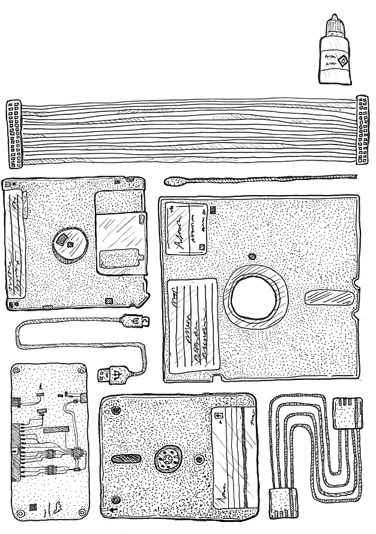
:::

# Abstract

This guide is written for people getting started with {index}`imaging floppy disks<media migration>` within the digital preservation community, particularly smaller institutions or those with tight budgetary constraints.

The guide starts by outlining how to acquire and set up the equipment. It will then give an example of a workflow for the transfer of floppy disks. Finally, it will highlight some obscure formats and how to get started with these. The assumption is made that you have a computer or laptop to connect the floppy controller to. This device does not have to be anything fancy or high-tech, as little processing power and storage is needed to work with floppy disks.

This guide was created for the iPRES 2024 workshop: "Working on a Budget With WANG Disks and Other Obscure Formats." The hardware and software identified below works for us in 2024, but these lists could go out of date quickly, either from support stopping or from more preferable options being developed.

# Getting started

## Step 1. Source and clean a floppy disk drive

First thing to say is that we are talking about floppy disks with a Shugart interface. So this does not include ZIP disks, JAZ drives, SuperDisks, Data Tapes or MO Disks. These may look similar to floppy disks or have been made with similar materials, but they need different interfaces to work. Floppy disk drives with a [Shugart interface](https://en.wikipedia.org/wiki/Floppy_disk_drive_interface) include: 8-inch drive, 5.25-inch drive, 3.5-inch drive & 3-inch (Amstrad) drive.

Make sure you know what floppy disk drive is needed to read your floppy disks. First off, make sure you are sourcing a drive for the right format (3-inch, 3.5-inch, 5.25-inch or 8-inch). Secondly, make sure the [density](https://en.wikipedia.org/wiki/Disk_density) corresponds with the drive. There will be single density, double density and high density floppy disks. If you are unsure, try and obtain the newest possible model you can get your hands on, as newer models for a given disk size will typically read older variants.

To source a floppy disk drive, it is worth asking around and seeing if colleagues within your institution may have one lying around in their loft/attic. If this is not the case, other options include retro gaming websites and secondhand sites, such as eBay. When sourcing a drive, it is also a good moment to source a number of dummy disks, which can be used for testing later on.

Most of these drives will not have been used for a number of years, so giving them a good clean will be essential. This can be done with isopropyl alcohol. Focusing on [cleaning the heads](https://www.retrotechnology.com/herbs_stuff/clean_disks.html). Floppy disk drives are quite robust, but may need their driver belt replaced. There are kits and tutorials available online detailing how to do this (for example [a very detailed example for an Amstrad drive](https://www.spectrumforeveryone.com/technical/replacing-drive-belt-3-fdd/)).

## Step 2. Invest in a floppy controller

The next step is to purchase a floppy controller. There are a several [different options](https://wiki.foone.org//w/Floppy_Controllers) out there, a number of them being highlighted in more detail below. Some only work with particular operating systems, so do make sure that you are obtaining an appropriate one for the device you will be using it with.

<table>
<colgroup>
<col style="width: 74%" />
<col style="width: 25%" />
</colgroup>
<thead>
<tr class="header">
<th>
<a href="https://cowlark.com/fluxengine/"><strong>FluxEngine</strong></a>

Pros: Relatively cheap

Cons: Needs to be soldered, firmware can only be updated with Windows

Note: Can run nearly all functions of the FluxEngine software with the GreaseWeazle hardware (below)
</th>
<th>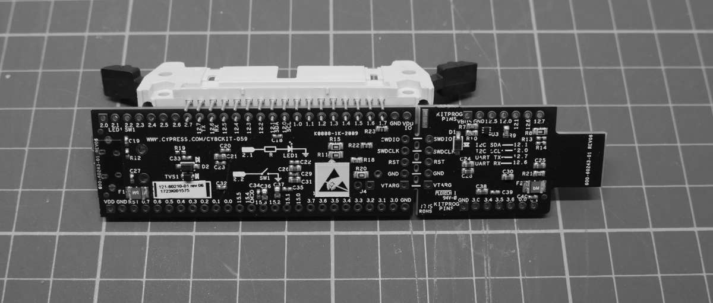</th>
</tr>
</thead>
</table>

<table>
<colgroup>
<col style="width: 74%" />
<col style="width: 25%" />
</colgroup>
<thead>
<tr class="odd">
<th>
<a href="https://www.kryoflux.com/"><strong>Kryoflux</strong></a>

Pros: Good support and guidance, including the <a href="https://github.com/archivistsguidetokryoflux/archivists-guide-to-kryoflux">Archivist’s Guide to Kryoflux</a>

Cons: Can be expensive for memory institutions
</th>
<th>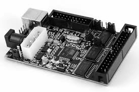</th>
</tr>
</thead>
</table>

<table>
<colgroup>
<col style="width: 74%" />
<col style="width: 25%" />
</colgroup>
<thead>
<tr class="header">
<th>
<a href="https://github.com/keirf/greaseweazle"><strong>GreaseWeazle</strong></a>

Pros: Open-source software, active community, cheap board, integrated power connector for 3.5" drives

Cons: Community build, so no clear support, can be quite technical when looking for solutions
</th>
<th>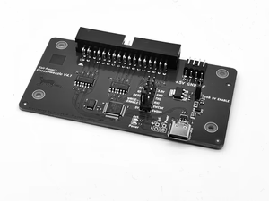</th>
</tr>
</thead>
</table>

<table>
<colgroup>
<col style="width: 74%" />
<col style="width: 25%" />
</colgroup>
<thead>
<tr class="odd">
<th>
<a href="http://www.deviceside.com/fc5025.html"><strong>FC 5025</strong></a>

Pros: Relatively cheap, easy to use software, able to directly extract files from many formats

Cons: Only for certain common formats, only for 5.25-inch floppies, disk errors cannot be looked at in detail
</th>
<th>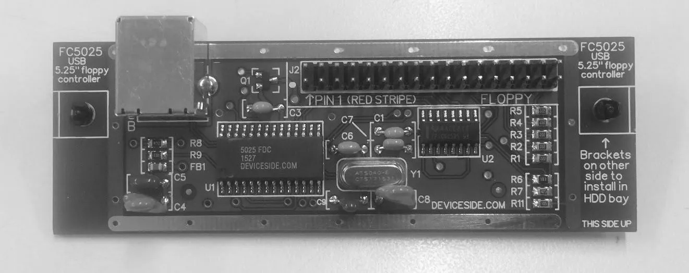</th>
</tr>
</thead>
</table>

<table>
<colgroup>
<col style="width: 74%" />
<col style="width: 25%" />
</colgroup>
<thead>
<tr class="header">
<th>
<a href="https://www.cbmstuff.com/index.php?route=product/product&amp;product_id=52"><strong>Supercard Pro</strong></a>

Pros: Relatively cheap, can read some obscure formats not offered by other floppy controllers, integrated power connector for 3.5" drives

Cons: Only for 3.5-inch and 5.25-inch floppies
</th>
<th>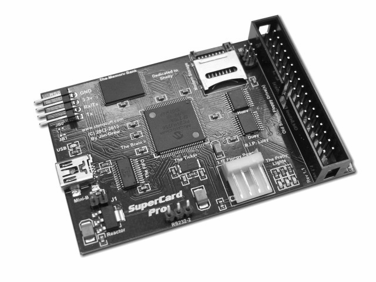</th>
</tr>
</thead>
</table>

<table>
<colgroup>
<col style="width: 74%" />
<col style="width: 25%" />
</colgroup>
<thead>
<tr class="odd">
<th>
<a href="https://applesaucefdc.com/"><strong>AppleSauce</strong></a>

Pros: Software has been created with preservation in mind, interface is easy to use and has many extra options, including visualisation and extraction.

Cons: Board has been out of stock for a long time, software is currently MacOS only.
</th>
<th>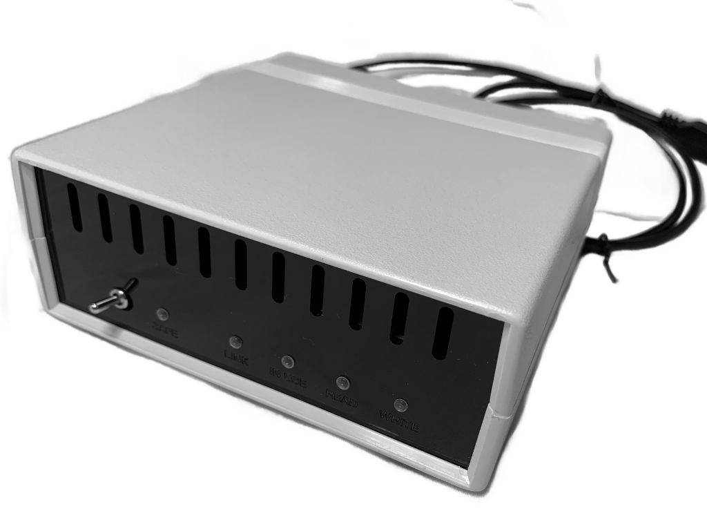</th>
</tr>
</thead>
</table>

<table>
<colgroup>
<col style="width: 74%" />
<col style="width: 25%" />
</colgroup>
<thead>
<tr class="header">
<th>
<a href="https://www.laludotheque.fr/wp-content/uploads/2021/01/user_manual_pauline_v1.3_EN.pdf"><strong>Pauline</strong></a>

Pros: Open-source, works with a web interface, so not dependent on a specific operating system

Cons: Soldering is involved
</th>
<th>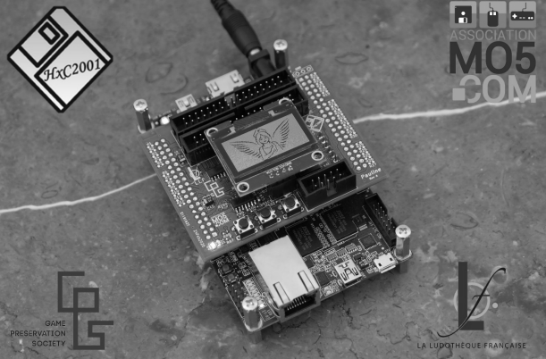</th>
</tr>
</thead>
</table>

## Step 3. Ensure you have the right cables & power source

It is crucial to ensure you are using the right power and ribbon cable for the floppy disk drive. Best case scenario it will result in a floppy disk drive that can’t image, but in the worst case it could lead to a component being fried (in most cases the floppy controller). The table below outlines what cables are needed for what type of floppy disks drive.

<table>
<colgroup>
<col style="width: 29%" />
<col style="width: 33%" />
<col style="width: 37%" />
</colgroup>
<thead>
<tr class="header">
<th><strong>Floppy Disk Drive</strong></th>
<th><strong>Ribbon Cable</strong></th>
<th><strong>Power Cable</strong></th>
</tr>
<tr class="odd">
<th>8-inch</th>
<th>50-pin Card Edge</th>
<th>Depends on the drive, at least 25V but sometimes needs mains voltage</th>
</tr>
<tr class="header">
<th>5.25-inch</th>
<th>34-pin Card Edge</th>
<th>4-pin Molex (12V)</th>
</tr>
<tr class="odd">
<th>3.5-inch</th>
<th>34-pin (with or without a twist)</th>
<th>4-pin floppy drive cable (5V)</th>
</tr>
<tr class="header">
<th>3-inch</th>
<th>26-pin</th>
<th>Flipped 4-pin drive cable (12V)</th>
</tr>
</thead>
<tbody>
</tbody>
</table>

The ribbon cable connects the floppy disk drive to the floppy controller. In most cases, the floppy controller will be 34-pin itself, but do check. 34-pin to 34-pin and/or 34-pin card edge are currently plentiful and cheap and easy to acquire. eBay is a good place to find many of these cables, otherwise retro gaming shops are a good option, or ask around. Some cables will have only 33-pin to align with the 3.5 inch floppy drive connector, which may have one pin missing. Be sure to check that the cable matches your controller and floppy drive.

Next step is to have a power source to use with the floppy disk drive. Some controllers (such as the GreaseWeazle) have a port to power a 3.5-inch floppy drive, but it is unlikely that any USB controller will be able to provide the 12V+ that other drives require. The other drives need more power and there are two options.

The first is to use a [power supply unit](https://en.wikipedia.org/wiki/Power_supply_unit_(computer)) (PSU) from an older computer; either one from a computer you have to hand, or one purchased separately. These will normally have either a Molex or 4-pin connections, but is not guaranteed. It is possible to buy converters if needed, these can be found on sites such as eBay.

The other option is to use a dedicated external power source for floppy drives and hard drives. These are typically much more portable than the PSU approach. 12V and 5V to Molex power supplies are readily available, which can then use a Molex to 4-pin adapter for 3.5-inch drives. This will work for the 3.5-inch and 5.25-inch drive.

The 8-inch needs more power, depending on the drive, and can get complicated. There is guidance out there for converters ([this](https://web.archive.org/web/20240831083002/https://www.dbit.com/fddc.pdf) being an example of one). For further information on getting an 8-inch drive up and running, a series of blog posts by Denise de Vries and her colleagues are available on the [OPF website](https://openpreservation.org/blogs/8-inch-disks-hp9845-endeavour-success-at-last/).

## Step 4. Download floppy controller software

Generally there will be dedicated software for any floppy controller, downloadable from their website. In many cases, this software can be run without needing administrator permissions, or even an installation requiring those permissions.

It is possible to use other pieces of software on certain floppy controllers; for example, the [FluxEngine software](https://github.com/davidgiven/fluxengine) can be used with the GreaseWeazle. Other controller software can also be used standalone, such as the Applesauce software which can be used as a standalone disk image analysis/repair/conversion tool. Workflows can certainly create a flux image with the controller software, and then use other software (potentially software for another controller) to convert that into a disk image.

Ensure you are installing the correct version of the tool for your operating system!

## Step 5. Test the floppy drive with dummy disks

Before using the floppy disk drive and the floppy controller on collection material, or other precious floppy disks, it is worth testing it with a number of test disks.

These are relatively plentiful for purchase online, but it is likely worth asking around colleagues and similar for old disks they no longer need. Ideally you would want a disk similar to those held in your collections, but any disk with data on (doesn’t matter if it is word processor files, software or something else) can show that the drive is functional.

Remember that controllers may need different settings to read different types of the same size of disk (eg changing with disk density, and brand).

## Step 6. How to inspect disks & maintain clean heads

A lot of the floppy disks that are in collections will have been there for a long time, resulting in often dusty or even mouldy disks. This means that keeping the drives clean is essential to getting clean reads of the carriers.

You should inspect floppy disks before inserting them into the drive for obvious contamination. There are also kits out there to [clean floppy disks when mouldy](https://www.floppycleaner.co.uk/), but these should be used with caution, as there is no clear indication that they are helpful and may cause further damage to the floppy disk.

It is possible and relatively simple to clean the heads on your floppy drive. In our experience this is frequently necessary with 5.25-inch drives, and less so with 3.5-inch or 3-inch drives. There are a couple of ways to clean your drive.

First, you can use a small amount of isopropyl alcohol and cotton swabs to directly clean the head. We would recommend watching [a demonstration](https://www.youtube.com/watch?v=ph3LIP7JqQ8) online before attempting this yourself.

Secondly, you can purchase a head cleaning disk for this purpose (example [here](https://www.baffo71.com/details.php?id_prodotto=21)).

A handy tip to have is to keep a set of non-collection test disks that you know read well, these can be inserted and checked to see if the heads are dirty and need a clean. Do keep in mind that these disks will also start deteriorating with a lot of use, so a selection of test disks is recommended.

Proper handling of the disks themselves is also important. Floppy disks are fragile and can be easily damaged by dirt, dust, fingerprints, and magnetic fields, having a dedicated workstation helps to avoid issues. You should also be aware there are [modern devices](https://page2pixel.org/2016/03/floppy-disks-and-modern-gadgets/) which can cause issues with floppy disks, like your cell phone, or even your laptop which can cause damage with prolonged exposure.

# Imaging floppy disks

The instructions on how to disk image a floppy disk will depend on the type of floppy controller being used. There is good documentation with all floppy controllers. Some have graphical interfaces and others will run from the command line.

## Step 1. Create a flux stream copy

In most cases it is handy to copy the disk’s flux stream directly. It is possible to then convert this flux stream to a disk image (often using the same tools that generated the flux stream, reading it again as if the disk were inserted), but it is not possible to convert an already created disk image to a RAW flux stream.

This is advisable as if the wrong format is chosen for the disk image, data can be lost, and the RAW flux stream is easier to import into some tools.

There are a few flux stream formats, such as .scp, .ctr, .raw, .flux, and .hfe; the exact type(s) your controller can output may vary.

## Step 2. Investigate the flux stream

For some quality assurance it is useful to check the RAW flux stream using a tool such as [HxC Floppy Emulator](https://github.com/jfdelnero/HxCFloppyEmulator) to see if the image was created correctly; it will highlight if there are any bad sectors. If there are bad sectors, cleaning the headers is a good first step, especially if the inner ring of the disk image is dirty. Another thing that could be explored is looking at cleaning the floppy disks themselves, as some of them are very mouldy, but there is not much research into this.

Another thing to keep an eye out for are alternating red and green rings (as below); this normally indicates a double density disk imaged on a high density disk drive. These non-existent tracks can then be set to be ignored when creating a disk image from the flux stream. The instructions for this will differ per floppy controller, but will be part of the documentation.

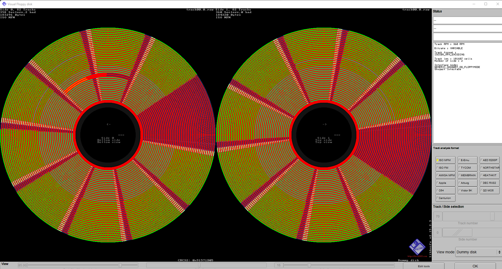

Also, as the floppy disks drives are interchangeable between formats and densities, any labels can be very misleading. It may have been created for a specific type of computer or drive, but it could have been re-used for something else, such as a high density disk being written to by a double density drive. This is another reason to take a flux copy of a disk first to analyse before creating a disk image.

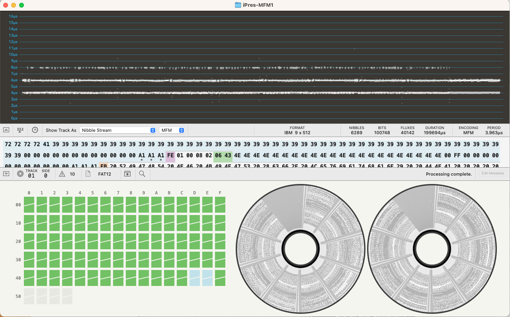

Another option, if you are on a Macintosh, is to use the [Applesauce software](https://applesaucefdc.com/software/). It was built specifically for Apple II and Macintosh disks, but can analyse many different formats. It does a great job of interpreting a flux stream and correctly assigning its format. It can read its native A2R flux format, SCP,HFE, and also Kryoflux and Greaseweazle raw streams. You can explore the disk and each sector as well as view the contents and extract the files retaining original dates and Macintosh specific attributes.

## Step 3. Create a disk image (if possible)

A list of all known floppy disk formats can be found [here](https://en.wikipedia.org/wiki/List_of_floppy_disk_formats). This can be really helpful when determining the format that you may have. Sometimes it is unclear from the disk itself. It may be missing its label or have been formatted in a completely different way. Most common formats are FM, MFM and Mac GCR.

However, not all formats are listed in this wiki. Examples of missing formats are ICL, Lexitron and WANG. For these disks a different approach is needed. Resources can be found at the bottom of this guide for certain formats, this list is not excessive, but is a starting point.

**Troubleshooting and bad sectors**

Not all disks will be successful when imaged. This can be caused by the deterioration of the media, damaged media, bent or warped media, or in some cases disks may be copy-protected. During imaging a sector of the disk may indicate it got a bad read and may try and read it a few more times before giving up. Knowing where the bad sectors are on the disk can guide you in determining how much effort is needed, it may be in an unused area of the disk. Trying a disk in multiple drives may help in recovering bad sectors. Giving the floppy disk drive a clean can also help with recovering bad sectors.

# Resources for obscure floppy disks

Best practice is to create a RAW flux stream. Once this has been created HcX floppy emulator can be used to have a look at the disk image. This will help in determining how many sectors and tracks there are. According to this a new profile can be added to the known formats on the floppy controller. A full tutorial for the GreaseWeazle on doing this can be found [here](https://wiki.techtangents.net/wiki/Floppy_Disk_Imaging).

Other things to consider is tracking down the original hardware, manuals or see what the online communities have been able to produce. Below there is some information listed for more obscure floppy disk formats, this list is not excessive and focuses around the formats that we are familiar with; WANG, Brother and Amstrad.

## WANG disks

WANG Laboratories made computers, calculators, and word processors. WANG computers and word processors reached the height of their use in the 1980’s, but in 1992, the company filed for bankruptcy. Some of the popular models included the WANG 2200, WANG VS, WANG 3300, WANG OIS, and more. WANG used its own variation of BASIC, and it also used a slight variation of ASCII called “Wang ASCII World Languages Character Set.” While specifically devoted to the WANG 2200, [the site](https://www.wang2200.org/) is a great place to start to learn more about WANG computers and how they worked.

Despite WANG’s ubiquity in the early 1980’s,[1] there is not a lot of documentation on WANG files (Word Processing or otherwise). There are a number of manuals on [the WANG 2200 site](https://www.wang2200.org/docs.html) as well as [the WANG 3300 site](https://www.wang3300.org/docs.html). There are emulators available for the WANG 2200 and WANG 3300, but they also require a thorough understanding of WANG and [WANG BASIC](https://www.wang2200.org/emu/html/disk_cheatsheet.html). The WANG 2200 emulator works with its own format called a WANG virtual disk (.[wvd](https://wikidp.org/Q105856575/preview)); you can find examples of WANG Virtual Disks that work in the emulator [here](https://wang2200.org/vmedia.html) (You can play some fun games!).

With a WANG 2200, you could create an “Archive Diskette” to save files to a floppy disk. The process is described in this [Word Processing Operator Manual](https://www.wang2200.org/docs/software/2200WordProcessingOperatorsGuide.700-6937.6-82.pdf). The resources listed here primarily focus on this type of disk.

**How do you know you have WANG files or a WANG disk?**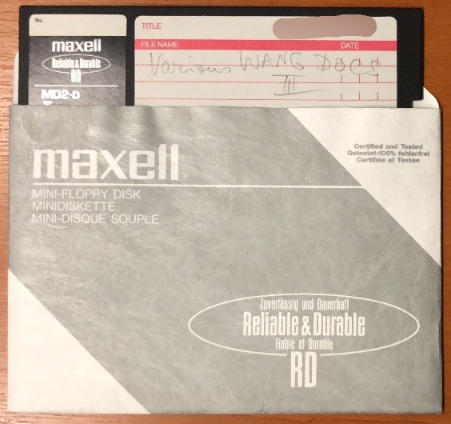

If you are lucky, your disks will have been identified as WANG disks on the labels (or will even have WANG stickers on them). If not, you may simply find that none of the available software can identify the type of disk. For WANG disks, we have found it effective to format them as an “ibm” type disk image using the FluxEngine. A sample command looks like this:

***fluxengine read ibm -s drive:0 -o ibm.img --copy-flux-to=ibm.flux --decoder.write_csv_to=ibm.csv***

You can then look at the .img file in a HexEditor. WANG Archive Diskettes have an alphanumeric code (four digits and a letter) at the beginning of the disk. Here is an example:

In this era of WANG Word Processing, the individual file names have similar codes consisting of 4 digits and a letter. If you have an Archive Diskette, you can get the list of files and their metadata (creation date, last modified date, “operator,” etc.), text files, and even carved word processing files saved as .rtf using the [set of WANG tools](https://github.com/richardlehane/wang) developed by Richard Lehane in GO. The text and formatting is reconstructed based on the information in [File Format Documentation for UN Parallel Texts](https://catalog.ldc.upenn.edu/docs/LDC94T4B-2/wang2iso.txt).

The WANG tools won’t work with all WANG files – especially later files seem to use neither the same disk ID, nor the document ID,so the tool does not recognize them as WANG disks or WANG files. These disks and files can be freely named. In this case, if you open the image in a HexEditor, you should be able to scroll through and read the files, although additional characters will disrupt the flow. If no other option seems to work, you could simply copy the text into a text file, which would at least give you the content of the files.

WANG disks and WANG file types still lack research and good options for emulation. This guide only offers some possibilities for working with WANG Word Processing files, but there is more work to be done.

## Brother disks

Certain models of Brother Typewriters included a floppy disk drive for saving and retrieving documents. These floppy disks are not compatible with a normal PC and write 120k or 240k to a DS/DD 3.5 floppy disk. [Using a FluxEngine board](https://cowlark.com/fluxengine/doc/disk-brother.html) you can capture the disk correctly and make a disk image which can be used to extract the text from the disk. You can also use the Applesauce software to view the final disk and extract contents. Note that different daisy wheel fonts and symbols could be used on the typewriter so it may be difficult to know what special characters are used.

## Amstrad disks

Amstrad disk drives can be hard to source. Looking at UK second hand websites can help here,as the Amstrad machines were very popular in the [UK](https://www.computinghistory.org.uk/det/1227/Amstrad-Plc/). As mentioned in the getting started part of this guide, Amstrad disks need a special power cable and a 26-pin connector cable. The best place to source these is by finding the original cables used on an Amstrad machine. But it is also possible to [DIY these](https://www.cpcwiki.eu/index.php/DIY:Floppy_Drives). Do make sure you use the right cables, as there is a chance to either fry the floppy controller, or the disk drive.

When working with these disks, it is easiest to create a raw flux stream in first instance. To create an image that can be used in emulators, HxC should be used, as explained in [this blog](https://muckypaws.com/2020/09/03/greaseweazle/). Floppy controllers may also offer the .DSK format, but there is a chance that this is the extended format, which is not the format needed for the Amstrad disk, as can be read about in [this blog](https://digitalpreservation-blog.lib.cam.ac.uk/hex-marks-the-spot-extracting-files-from-amstrad-disks-c97f811273ac). There are a number of emulators out there for the Amstrad disks, including [JOYCE](https://www.seasip.info/Unix/Joyce/index.html) and [CP/M box](https://www.habisoft.com/pcw/en.htm). To get the emulators to run a ‘start of day’ or boot disk is also required.

To extract files form the Amstrad disks, [Locolink](https://www.seasip.info/Unix/Joyce/locolink.html), [AILink](https://ai.ansible.uk/ailink.html) or [AmstradDSKExplorer](https://github.com/muckypaws/AmstradDSKExplorer) can be used.

:::{aside}
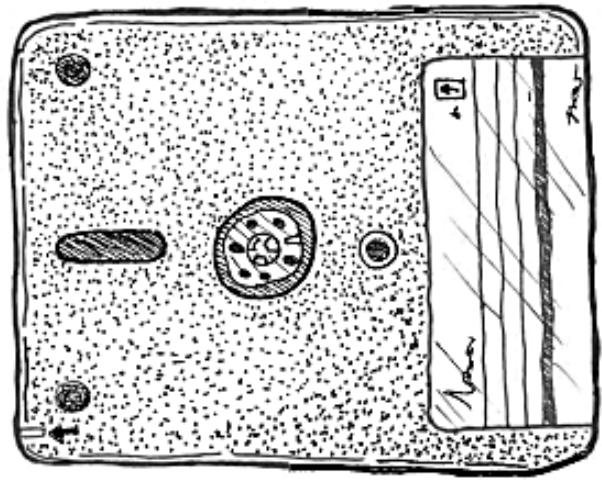
:::

[1] "In the early 1980s, more than 80% of the 2,000 largest U.S. companies used Wang office equipment, and in 1984 Wang Laboratories' profits reached \$210 million on sales of \$2.2 billion." Brewster, Mike. "An Wang: The Core of the Computer Era." Business Week. 2004-07-14. [https://web.archive.org/web/20160713102253/https://www.bloomberg.com/news/articles/2004-07-13/an-wang-the-core-of-the-computer-era](https://web.archive.org/web/20160713102253/https://www.bloomberg.com/news/articles/2004-07-13/an-wang-the-core-of-the-computer-era) Accessed: 2024-09-15.
