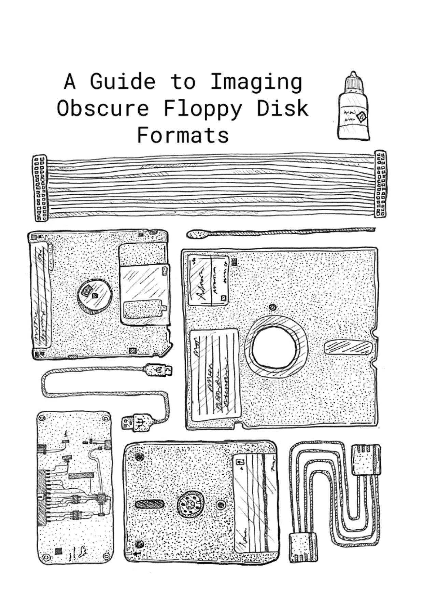

:::{warning} Status: Under Construction
This guide to imaging floppy disks is being developed as part of the [Future Nostalgia project](https://www.lib.cam.ac.uk/future-nostalgia), led by [Cambridge University Library](https://www.lib.cam.ac.uk/) and supported by the [Digital Preservation Coalition](https://dpconline.org).

The source for this publication is [this Google Doc](https://docs.google.com/document/d/1ZfPaXMOXCphfnDKKRoImzccHtY2M2hBZLI5mP65RNpk/edit) and comments and contributions are welcome!

You can also make suggestions via [GitHub issues](https://github.com/digipres/the-floppy-guide/issues) if you prefer.
:::

:::{aside}

:::

